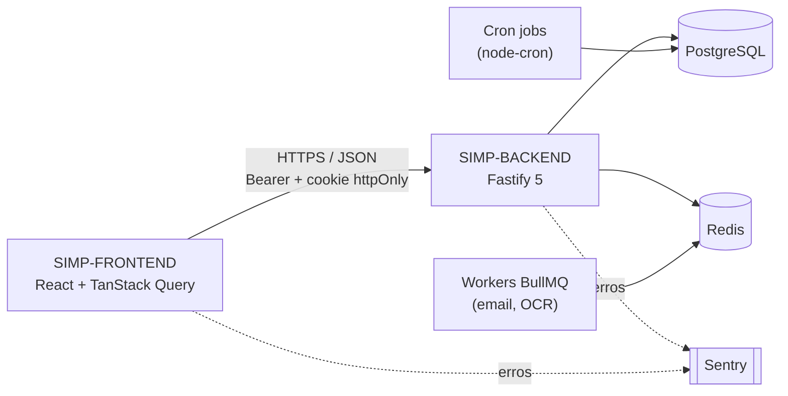
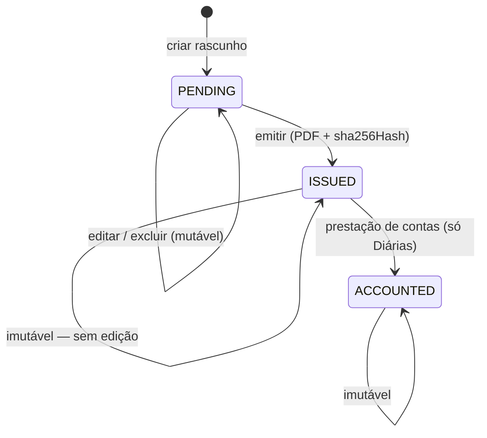

Sumário

Visão geral

- [O que é o SIMP](#visao-geral)
- [Arquitetura & stack](#arquitetura)

Fundamentos

- [Multi-tenancy & módulos](#multi-tenancy)
- [Autenticação & sessão](#auth-sessao)
- [RBAC & permissões](#rbac)
- [Motor orçamentário (QDD)](#motor-orcamentario)

Módulos de negócio

- [Admin & Super Admin](#admin-superadmin)
- [Departamentos](#departamentos)
- [Processos Virtuais](#processos-virtuais)
- [Convênios](#convenios)
- [Diárias & Frota](#diarias-frota)
- [Financeiro](#financeiro)
- [Conselhos](#conselhos)
- [Protocolos](#protocolos)
- [Comunicação](#comunicacao)
- [Biblioteca / GED](#biblioteca)
- [Workspaces & Tarefas](#workspaces)
- [Suporte](#suporte)
- [Auditoria](#auditoria)
- [Feriados](#feriados)
- [Portal Público](#portal-publico)
- [Calendário & Notas](#utilidades)

Padrões transversais

- [Padrões de dados](#padroes-dados)
- [Segurança & infra](#seguranca)
- [Jobs & filas](#jobs-filas)
- [Testes](#testes)
- [Seed scripts](#seeds)

Frontend

- [Camada de dados](#camada-dados)
- [Shell & guards](#shell-guards)
- [Estado & convenções](#estado)

Fechamento

- [Deploy](#deploy)
- [Glossário](#glossario)

Documentação técnica · referência de equipe

# SIMP — Sistema de Gestão Municipal

Atualizado em 2 de outubro de 2026 · repositórios `SIMP-FRONTEND` e `SIMP-BACKEND`, branch `develop`

01 · Visão geral

## O que é o SIMP

SIMP ("Simplifica") é uma plataforma SaaS multi-tenant para gestão administrativa de prefeituras e câmaras municipais brasileiras — orçamento (QDD), diárias, convênios, processos, financeiro, conselhos, protocolos, biblioteca digital e um portal público de validação de documentos.

Cada município é uma `Organization` isolada, com seus próprios usuários, papéis e módulos habilitados. A base está dividida em dois repositórios independentes, versionados juntos na branch `develop`.

| Repositório | Papel | Stack |
| --- | --- | --- |
| `SIMP-FRONTEND` | SPA consumida pelo navegador | React 19 · Vite 7 · TypeScript · TanStack Query v5 · shadcn/ui · Tailwind · React Router v7 |
| `SIMP-BACKEND` | API REST + jobs + filas | Fastify 5 · Prisma · PostgreSQL · Zod · TypeScript |

01 · Visão geral

## Arquitetura & fluxo de requisição

Uma SPA fala HTTP/JSON com uma API Fastify única; a API é a única porta de entrada ao Postgres. Filas e jobs cuidam do que não pode travar uma requisição.

**Pegadinha de roteamento** Nem toda rota do backend vive sob `/api/v1`. Auth, admin, users, roles, audit e communication estão sob o prefixo; `covenants`, `departments`, `finance`, `virtual-processes`, `qdd-items`, `workspaces`, `tasks`, `notifications`, `protocols` e `holidays` estão registrados na raiz (`src/config/routes.ts`). Confira o arquivo antes de assumir o prefixo.

02 · Fundamentos

## Multi-tenancy & módulos por organização

`Organization` é a raiz do sistema — praticamente todo modelo de negócio carrega um `organizationId`, e quase toda query de listagem o usa como filtro obrigatório.

#### Feature flags por organização

Cada módulo (financeiro, convênios, protocolos…) é ligado/desligado por `OrganizationModule` (único por `[organizationId, module]`). O middleware `requireModule(nome)` cacheia o resultado por 5 min e devolve `403 MODULE_DISABLED` quando o módulo não está habilitado.

#### Catálogo de módulos

Habilitados por padrão na criação de uma organização: `tasks, finance, communication, calendar, notes, departments, library, covenants`. Habilitados manualmente, por contrato: `virtual_processes, protocols, councils, support, dailyAllowances, fleetFuelings`.

**Kill switch de suspensão** `Organization.isActive = false` derruba toda requisição de usuários daquela org (cache de 60s, invalidado na hora via `invalidateOrgStatusCache`) — exceto Super Admins, que precisam continuar entrando para poder reativar a própria organização suspensa.

02 · Fundamentos

## Autenticação & sessão

- JWT de acesso (15 min, HS256) + cookie `httpOnly`/`sameSite=strict` de refresh — o frontend nunca lê o refresh token.
- Cada token carrega um **fingerprint** da requisição (`calculateRequestFingerprint`); se não bater com o fingerprint atual, a sessão é invalidada mesmo com token ainda válido — proteção contra token roubado e levado para outro dispositivo.
- No frontend, 401 dispara um refresh automático com fila de coalescência (requisições concorrentes esperam um único refresh); `ORGANIZATION_SUSPENDED` e `SESSION_INVALIDATED` pulam o refresh e redirecionam direto (`/acesso-suspenso` e `/login?reason=session-invalidated`).
- Login tem Cloudflare Turnstile (puláve l apenas sem site key configurada) + honeypot de formulário — o backend recusa subir em produção se Turnstile estiver "habilitado" sem segredo configurado.

**Impersonação ("Entrar como")** Super Admin pode assumir a sessão de um admin de organização. O token de impersonação carrega as permissões *reais* do admin impersonado (nunca um claim fixo — um bug antigo travava rotas que confiavam direto em `request.user.permissions` do token). No frontend isso aparece como uma barra âmbar fixa no Topbar com botão "Sair da Impersonação".

02 · Fundamentos

## RBAC & permissões

`Role.permissions` é uma lista de strings no formato `dominio:acao` (ex.: `finance:read`, `covenants:delete`). Um usuário tem N roles; suas permissões efetivas são a união de todas.

- `User.isSuperAdmin` é uma flag nativa, separada de qualquer role — bypassa autenticação de organização, feature flags e checagem de permissão em todo lugar.
- A permissão `system:admin` é um bypass equivalente, mas concedido via role — cobre quem deve agir como "dono do sistema" sem ter a flag nativa.
- A role global `admin` é **self-healing**: toda vez que é criada/tocada, ressincroniza com o catálogo atual de permissões (`ensureAdminRole`) — sem isso, uma permissão nova adicionada ao catálogo nunca chegaria a admins de organizações já existentes.
- Todo endpoint reconsulta o banco a cada requisição (zero-trust) — o payload do JWT nunca é usado como fonte de verdade para permissões.

src/middleware/auth.middleware.ts · src/services/rbac.service.ts

02 · Fundamentos

## Motor orçamentário dinâmico (QDD)

O Quadro de Detalhamento da Despesa (QDD) é o orçamento real de uma prefeitura, dividido em **fichas** — cada uma com uma `fonte` de recurso e uma `natureza de despesa`.

QddItem.valorOrcado — único valor gravado − Σ DailyAllowance.totalAmount (status ISSUED/ACCOUNTED) − Σ VirtualProcess.totalValue − Σ Covenant.transferValue ─────────────────────────────────── = saldoRestante — calculado NA LEITURA, nunca persistido

- **Nunca persistido:** `valorUtilizado`/`saldoRestante` são sempre agregados ao vivo (`budgetService.getBalancesForItems`) — persistir exigiria reconciliar a cada vínculo/edição/exclusão, com risco real de dessincronia sob concorrência.
- **Overrun não bloqueia:** estourar o orçado é rotina na administração pública (suplementação, remanejamento) — o sistema grava `budgetOverrun: true` para auditoria, mas nunca impede a operação.
- **Snapshot no vínculo:** ao emitir uma diária ou vincular um processo/convênio a uma ficha, o texto da dotação (`qddFichaSnapshot`, `qddFonteSnapshot`, `qddNaturezaSnapshot`) é copiado como texto — uma edição posterior na ficha nunca reescreve um documento já emitido.
- **Ledger de alterações:** `BudgetHistory` é um log append-only de toda mudança em `valorOrcado` (valor anterior, novo valor, variação %, motivo obrigatório) — nunca editado nem excluído.

src/services/budget.service.ts

03 · Módulos de negócio

## Catálogo de módulos

Cada ficha abaixo resume um domínio de negócio: o que faz, os modelos principais, as rotas da API e as páginas do frontend que o implementam.

MÓDULO

### Admin & Super Admin

Painel exclusivo do Dono do Sistema: cadastro de organizações, módulos habilitados, suspensão (kill switch), branding e impersonação.

#### Modelos

- `Organization`
- `OrganizationModule`

#### Rotas principais

- GET`/admin/organizations`
- PATCH`/admin/organizations/:id`
- PATCH`/admin/organizations/:id/modules/:module`
- POST`/admin/organizations/:id/impersonate`

#### Páginas

- `AdminPanel`
- `AdminNewOrganizationPage`
- `AdminOrganizationDetailPage`

**Destaque** Criar uma organização é uma única transação Prisma: cria a `Organization`, semeia todas as linhas de `OrganizationModule`, garante a role global `admin` e cria o primeiro usuário admin com senha temporária enviada por e-mail.

MÓDULO

### Departamentos

Cadastro das secretarias/setores — o eixo em torno do qual orçamento, diárias, convênios e processos se organizam.

#### Modelos

- `Department` (id `nanoid()`, não UUID)

#### Rotas principais

- GET`/departments`
- GET`/departments/:id/dossier`

#### Páginas

- `DepartmentsPage` + `DepartmentFormDialog`
- `DepartmentDetailPage` — 7 abas: Servidores, Conselhos, Convênios, Processos, Diárias, Abastecimentos, Orçamento/QDD

**Destaque** O "Dossiê do Setor" gera um PDF único agregando todas as abas via um motor de relatório compartilhado — uma seção não pedida é simplesmente omitida, nunca mostrada vazia (evita sugerir "este setor tem zero convênios" quando a seção nem foi consultada).

MÓDULO

### Processos Virtuais

Tramitação de processos administrativos vinculados a uma dotação orçamentária (QDD), com categorias/origens/empresas cadastráveis.

#### Modelos

- `VirtualProcess`
- Categoria / Origem / Empresa (tabelas de apoio)

#### Rotas principais

- GET`/virtual-processes`
- POST`/virtual-processes`

#### Páginas

- `Configuracoes.tsx`
- `UniversalProcessModal` (modal global via contexto, botão "Gerenciar")

**Destaque** Higienização de cadastro (`toTitleCase`/`collapseWhitespace` em `src/lib/string-utils.ts`) bloqueia duplicatas por capitalização ("oBrAs" vs "Obras") e preserva siglas (FPM, ICMS) — aplicada tanto na página de Configurações quanto no modal universal, que são dois pontos de entrada distintos para o mesmo cadastro.

MÓDULO

### Convênios

Convênios com entes estaduais/federais — cadastro, cascata de dotação QDD e automação financeira da entrada do recurso transferido.

#### Modelos

- `Covenant` (+ snapshots de QDD)
- `CovenantType` / `Convenente` / `Concedente`

#### Rotas principais

- POST`/covenants`
- GET`/covenants/types`, `/convenentes`, `/concedentes`
- DEL`/covenants/:id`

#### Páginas

- `CovenantsPage` (abas Convênios / Configurações de Dados)
- `CovenantFormDialog`

**Destaque — automação atômica** Informar dados bancários + valor de transferência dispara uma única transação Prisma: cria a `BankAccount` (sempre com `initialBalanceCents: 0`) e, no mesmo instante, um `FinanceEntry` do tipo `INCOME` com o valor do convênio — tudo ou nada. Validado via API real em 2026-10-02: conta nasceu zerada, lançamento entrou como receita, e o saldo da ficha QDD vinculada caiu corretamente.

MÓDULO

### Diárias & Frota (Abastecimentos)

Diárias de servidor e abastecimentos de frota são o mesmo tipo de documento oficial — registro numerado com ciclo de vida de imutabilidade, só muda o domínio.

#### Modelos

- `DailyAllowance` + `DailyAllowanceReceipt`
- `Beneficiary` (autocomplete, nunca fonte de verdade)
- `FleetFueling`

#### Rotas principais

- POST`/api/v1/daily-allowances`
- PATCH`/api/v1/daily-allowances/:id/issue`

#### Páginas

- `DailyAllowanceList` / `DailyAllowanceForm` (wizard de 4 blocos, QDD cascateado por departamento)
- `FleetFuelingList` / `FleetFuelingForm` (espelha a mesma UI de propósito)

**Destaque** Uma vez emitido, o PDF e o `sha256Hash` são prova pública — regenerar o PDF produziria bytes diferentes e dessincronizaria o hash validável no portal público. Por isso update/delete são recusados no backend a partir de `ISSUED`, não só escondidos na UI.

MÓDULO

### Financeiro

Contas bancárias, categorias e lançamentos — mais um painel de inteligência com previsão e detecção de anomalia calculada no cliente.

#### Modelos

- `BankAccount`
- `FinanceEntry` (soft-delete `deletedAt`)
- `FinanceCategory`

#### Rotas principais

- GET`/finance/accounts`, `/entries`
- POST`/finance/entries`
- DEL`/finance/entries/:id` (soft)

#### Páginas

- `FinanceiroOverview`, `Lancamentos`, `Contas`, `Categorias`, `Relatorios`
- `Inteligencia` — Holt's linear exponential smoothing + z-score sobre a série mensal

**Destaque** `FinanceEntry` é soft-delete por desenho — a trilha de auditoria financeira não permite exclusão física. Isso bloqueia a FK de `BankAccount` enquanto houver qualquer lançamento (ativo ou soft-deletado) vinculado, por construção.

MÓDULO

### Conselhos

Conselhos municipais — composição (mesa diretora), reuniões, atas e assinatura digital via gov.br.

#### Modelos

- `Council` / `CouncilMembership`
- `CouncilMeeting` / `MeetingAgendaItem` / `MeetingAttendance`
- `CouncilDocument` / `SignatureRequest`

#### Rotas principais

- GET`/councils`
- POST`/councils/sign/initiate`

#### Páginas

- `CouncilsPage` / `CouncilDetailPage` / `MeetingDetailPage`
- `CouncilSignReturnPage` — landing fixa de retorno do gov.br

**Destaque — congelamento de 72h** Uma reunião fica imutável 72 horas após o horário agendado (comparação em epoch-time, nunca arredondada por dia) — sem edição de ata, pauta, presença ou documentos depois disso, e deliberadamente sem mecanismo de desbloqueio no produto.

MÓDULO

### Protocolos

Numeração oficial de documentos (comunicações e normativos) com controle de concorrência real sobre o contador.

#### Modelos

- `OfficialDocument`
- `SequenceControl` (contador por org+setor+tipo+ano)

#### Rotas principais

- POST`/protocols`
- PATCH`/protocols/:id/status`

#### Páginas

- `OfficialProtocolsPage` → `GenerateProtocolModal` → `AttachDocumentModal`

**Destaque** Numeração sequencial roda em transação **Serializable** com retry (até 3x em conflito `P2034`); numeração manual (Normativos) soma um índice único parcial no banco como garantia real sob concorrência, não apenas uma checagem prévia na aplicação.

MÓDULO

### Comunicação

Mensageria interna no estilo e-mail entre colegas da mesma organização — distinta do portal público de validação.

#### Modelos

- `CommunicationDocument`
- `DocumentRecipient` (TO/CC/BCC)

#### Rotas principais

- GET`/api/v1/inbox`, `/sent`
- POST`/api/v1/messages`

#### Páginas

- `Communication.tsx` — Inbox/Sent + `NewMessageModal`, deep-link via `?msgId=`

**Destaque** O filtro de organização é fail-closed: Super Admin vê tudo, mas um usuário comum sem `organizationId` recebe 403 em vez de uma query sem filtro.

MÓDULO

### Biblioteca / GED

Repositório de documentos com níveis de acesso, categorias e trilha de auditoria por documento.

#### Modelos

- `LibraryDocument` (soft-delete, `accessLevel` 1–3)
- `DocumentCategory`

#### Rotas principais

- POST`/api/v1/library/upload`
- GET`/api/v1/library/:id/logs`

#### Páginas

- `LibraryPage` — lista/grade, download em zip em lote

**Destaque** Ingestão de OCR já está cabeada via fila BullMQ, mas **desligada** em produção ("pdf-parse instável + custo de CPU") — o worker apenas loga e descarta o job.

MÓDULO

### Workspaces & Tarefas

Quadros Kanban pessoais ou por setor, com checklist, anexos e histórico por tarefa.

#### Modelos

- `Workspace` / `WorkspaceMember`
- `Task` (código autoincrement) / `ChecklistItem` / `TaskHistory`

#### Rotas principais

- GET`/workspaces`
- PATCH`/tasks/:id/status`

#### Páginas

- `WorkspacesPage` (abas Meus / Setoriais)
- `WorkspaceDetailPage` — Kanban com `@dnd-kit/core`

**Destaque** Um job horário (`expire-tasks.job.ts`) vira em lote tarefas vencidas para `EXPIRED` e notifica os responsáveis — a expiração não depende de ninguém abrir a tarefa.

MÓDULO

### Suporte

Central de tickets/chat entre organizações e a equipe do SIMP.

#### Modelos

- `SupportRequest` (TICKET/CHAT)
- `SupportMessage`

#### Rotas principais

- GET`/support/insights`
- PATCH`/support/:id/status`

#### Páginas

- `SupportAdminPage` (super admin)
- `SupportWidget` — flutuante, visível em toda a aplicação autenticada

**Destaque** Super Admins não podem abrir chamado (403) — eles só respondem. A primeira resposta de um admin avança automaticamente `OPEN → IN_PROGRESS`.

MÓDULO

### Auditoria

Trilha de auditoria imutável, só para leitura — painel administrativo movido para sob o guarda-chuva do Dono do Sistema.

#### Modelos

- `AuditLog` (índices em userId/action/resource/createdAt)

#### Rotas principais

- GET`/api/v1/audit` — única rota do módulo

#### Páginas

- `AuditLogPage` em `/admin/auditoria`, sob `SuperAdminRoute`

**Destaque** Duas camadas independentes de imutabilidade: contrato de código (a interface `LedgerAdapter` só expõe `record`/`query`) e um trigger de banco bloqueando UPDATE/DELETE direto na tabela. Em produção, o driver pode trocar para Amazon QLDB.

MÓDULO

### Feriados

Calendário de feriados por organização — alimenta a regra de justificativa obrigatória de fim de semana/feriado nas Diárias.

#### Modelos

- `Holiday` (escopo NATIONAL/STATE/MUNICIPAL)

#### Rotas principais

- GET`/holidays`
- POST`/holidays`

#### Páginas

- `HolidaysDialog` (aberto a partir do formulário de Diárias)

**Destaque** Todo feriado registrado é tratado de forma idêntica na regra de justificativa, independente do escopo — o escopo é puramente para agrupamento visual.

MÓDULO

### Portal Público

Validação de autenticidade de documentos via QR code — a única superfície do sistema sem login, aberta ao cidadão.

#### Modelos

- `ExportedDocument`

#### Rotas principais

- GET`/api/v1/public/validate/:uuid`

#### Páginas

- `PublicHome` / `DocumentValidation` — sob `PublicLayout`, sem sidebar, sem auth

**Destaque** A resposta nunca inclui PII (nome do beneficiário, valores) — só tipo, data, hash e nome do órgão emissor. Registro de exportação falho é só logado, nunca bloqueia o download do usuário.

MÓDULO

### Calendário & Notas

Utilidades pessoais do usuário — agenda e bloco de notas, agrupadas como filhas de "Utilidades" na navegação.

#### Modelos

- Eventos de calendário
- Notas (paleta de 8 cores)

#### Rotas principais

- GET`/api/v1/calendar`, `/notes`

#### Páginas

- `Calendar.tsx` — dia/semana/mês/ano, sem lib externa de calendário
- `Notes.tsx`

**Destaque** Módulos gateados individualmente (`calendar`, `notes`) mesmo aparecendo como uma única seção na sidebar.

04 · Padrões transversais

## Padrões de dados no schema

- **Estratégia de ID inconsistente por desenho:** alguns modelos usam `cuid()`, outros `nanoid()` (ex.: `Department.id`) — um validador Zod `.uuid()` aplicado sem checar rejeita departamentos reais. Já mordeu o módulo de Protocolos duas vezes.
- **Snapshot em vez de join vivo:** `VirtualProcess`, `Covenant` e `DailyAllowance` copiam o texto da dotação QDD no momento do vínculo — nunca uma referência que mudaria retroativamente.
- **ID público separado da PK:** `DailyAllowance.publicId`, `FleetFueling.publicId`, `ExportedDocument.publicId` são UUIDs independentes da chave primária — um link público pode ser revogado sem tocar FKs, e a PK nunca vaza para a internet.
- **Comportamento de FK documentado por campo:** `Restrict` onde apagar o pai apagaria lastro orçamentário já consumido; `SetNull` onde o vínculo é "informativo" (apagar um Departamento nunca apaga o registro financeiro); `Cascade` só para posse de fato (`Workspace → Task → {Assignee, ChecklistItem, Note}`).
- **Termos em português mantidos de propósito:** `ficha`, `fonte`, `naturezaDespesa`, `empenho`, `liquidação` não têm equivalente fiel em inglês no orçamento público brasileiro.

04 · Padrões transversais

## Segurança & infraestrutura

#### Honeypot anti-scanner

Rotas-isca (`/.env`, `/wp-admin`…) banem o IP no primeiro toque; um campo de formulário oculto (`phone_fax`) acumula "strikes" em vez de banir na hora, porque gerenciadores de senha por vezes preenchem campos escondidos.

#### Rate limit por IP real

Chaveado estritamente em `request.ip`, nunca em `X-Forwarded-For` bruto — variar o XFF a cada requisição já foi usado para resetar o limite de tentativas de login.

#### Config fail-fast

Todo env var passa por um schema Zod único no boot; falha derruba o processo. Turnstile "habilitado" sem secret key também impede o boot em produção.

#### Tratamento de erro centralizado

`setErrorHandler` único mapeia `ZodError`→400, códigos Prisma (`P2002`→409, `P2025`→404)→respectivos, erros ≥500 logados com stack mas mensagem removida em produção.

04 · Padrões transversais

## Jobs & filas

| Job | Frequência | Função |
| --- | --- | --- |
| `expire-tasks.job.ts` | a cada hora | Vira tarefas vencidas para `EXPIRED` + notifica responsáveis |
| `clear-notifications.job.ts` | diário, meia-noite | Limpa notificações por retenção configurável por usuário |
| `cleanup-govbr-states.job.ts` | a cada 30 min | Expira estados OAuth de assinatura gov.br pendentes |
| `covenant-expiry-alert.job.ts` | diário | Notifica 60/30 dias antes do fim de vigência de um convênio |

Filas BullMQ sobre Redis: `email-queue.ts` (e-mails de notificação, 3 tentativas com backoff exponencial) e `document-queue.ts` (OCR — atualmente um no-op, feature desligada).

04 · Padrões transversais

## Testes

#### Backend — unitários

Vitest, sem banco. Cobre serviços como fingerprint, ip-ban, turnstile, honeypot, daily-allowance, document-validation, council-compliance, audit-ledger.

#### Backend — e2e

`buildApp()` + `app.inject()` contra um Postgres real e isolado. Três camadas independentes impedem truncar o banco de dev: banco separado, URL obrigatoriamente terminada em `_e2e`, e um `SELECT current_database()` em runtime antes de qualquer truncate. Testes rodam em série (`maxWorkers: 1`) — compartilham o banco.

#### Frontend

Vitest + jsdom + Testing Library instalados e cabeados ao CI — mas **zero arquivos de teste existem** ainda (`passWithNoTests: true`, cobertura 0). Infra pronta, ninguém escreveu o primeiro teste.

#### Regra crítica sob teste

`finance-bank-account.e2e.spec.ts` garante por API real que toda `BankAccount` nasce com `initialBalanceCents: 0` (FR-016) — não pode ser violada em nenhuma rota de criação.

04 · Padrões transversais

## Seed scripts — dataset de demonstração

`prisma/seeds/seed.ts` faz um bootstrap mínimo (zera tudo, cria um único Super Admin). Os scripts em `src/scripts/seed-*.ts` formam uma cadeia separada que popula um dataset multi-organização realista, nesta ordem:

| # | Script | Semeia |
| --- | --- | --- |
| 1 | `seed-admin.ts` | Super Admin da plataforma |
| 2 | `seed-organizations.ts` | Organizações fictícias (CNPJ com dígito verificador real) |
| 3 | `seed-departments.ts` | Secretarias por organização (formato executivo vs. legislativo) |
| 4 | `seed-org-admins.ts` | Um admin ativo por org (para o botão "Impersonar") |
| 5 | `seed-org-roles-users.ts` | 4 roles setoriais × 15 usuários por org |
| 6 | `seed-qdd.ts` | 8 fichas QDD por departamento |
| 7 | `seed-finance.ts` / `seed-operations.ts` | Financeiro, Processos Virtuais, Convênios, Protocolos |
| 8 | `seed-workspaces.ts` | Workspaces + tarefas com checklist/histórico |
| 9 | `seed-councils.ts` | 5 conselhos/org, mesa diretora + 10 reuniões cada |
| 10 | `seed-daily-allowances.ts` | Beneficiários + diárias (rascunho e emitidas) |
| 11 | `seed-support.ts` | 31 chamados de suporte por org, com histórico coerente |

Convenção comum: `randomInt` (CSPRNG) em vez de `Math.random()` mesmo para dado de teste — para manter o alerta de "randomness insegura" reservado a casos que realmente importam. A idempotência é upsert onde existe uma chave natural no schema, e destruir-e-recriar onde não existe.

05 · Frontend

## Camada de dados

Padrão consistente em 18+ domínios: um `src/lib/api/x.ts` (serviço fino sobre `fetch`) pareado 1:1 com `src/hooks/useX.ts` (`useQuery`/`useMutation` + `invalidateQueries`).

- Cliente HTTP único em `src/lib/api.ts` — Bearer token em memória, `credentials: "include"` para o cookie httpOnly de refresh viajar automaticamente.
- 401 dispara refresh automático com fila de coalescência; `ORGANIZATION_SUSPENDED` e `SESSION_INVALIDATED` pulam o refresh e redirecionam direto.
- Suporte nativo a `responseType: "blob"` — necessário para todo PDF/ZIP de documento oficial gerado no sistema.

05 · Frontend

## Shell & guards de rota

Todo guard é um nó de layout envolvendo `<Outlet/>` em `router.tsx`, nunca um HOC. A aninhagem padrão é deliberada: esconder algo da sidebar nunca é suficiente, a URL também precisa estar protegida.

ProtectedRoute — autenticado? └─ ModuleGate(módulo) — módulo habilitado na org? (super admin sempre passa) └─ PermissionGate(anyOf) — usuário tem alguma das permissões? └─ página real

A Sidebar é inteiramente data-driven (`NAV_SECTIONS`), cada item carregando seu próprio `module`/`anyOf` — Super Admins veem uma seção inteiramente separada (âmbar) em vez do menu normal.

05 · Frontend

## Estado & convenções

- Sem Redux/Context global de auth — identidade e permissões vêm de uma única entrada de cache do TanStack Query (`["auth","me"]`), derivada por funções puras em `src/lib/permissions.ts`.
- Notificações via **Server-Sent Events** real (`EventSource`), com fallback automático para polling de 30s após falhas consecutivas — não é um `refetchInterval` do TanStack Query.
- Dois contextos de modal "universal" (Finance e Process) montados uma vez em `AppLayout`, para que qualquer formulário aninhado abra o gerenciador de categorias/cadastros sem prop-drilling.
- `IdleSessionGuard` — logout por inatividade de 30 min, com aviso e contagem regressiva antes de encerrar.

06 · Fechamento

## Deploy

Frontend: deploy automático na Vercel a cada push em `develop` — nunca direto em `main`. `vercel.json` aplica rewrites de SPA e um conjunto de headers de segurança notavelmente estrito (`X-Frame-Options: DENY`, HSTS preload, `frame-ancestors 'none'`).

Backend: processo Fastify de longa duração com inicialização em sequência — Sentry, depois a aplicação, conexão com o banco, conexão best-effort com Redis (login funciona mesmo se o Redis cair — o cache de ban por IP apenas degrada para por-instância), jobs cron, workers BullMQ, só então `listen()`. Shutdown gracioso em `SIGINT`/`SIGTERM`.

06 · Fechamento

## Glossário de domínio

| Termo | Significado |
| --- | --- |
| **QDD** | Quadro de Detalhamento da Despesa — o orçamento detalhado por ficha, fonte e natureza de despesa |
| **Ficha** | Uma linha orçamentária individual dentro do QDD |
| **Fonte** | Origem do recurso (ex.: FPM, recurso próprio, convênio) — recursos carimbados não podem transitar entre fontes livremente |
| **Natureza de despesa** | Classificação legal do tipo de gasto (ex.: "3.1.90.04 — Contratação por tempo determinado") |
| **Empenho / Liquidação** | Fases da despesa pública (Lei 4.320/64) — reserva do valor e confirmação de que o serviço/bem foi entregue |
| **Remanejamento** | Realocação de verba entre fichas — rotina na administração pública, por isso estourar o orçado nunca bloqueia, só sinaliza |
| **Prestação de contas** | Comprovação pós-viagem de uma diária (Anexo II) — move o registro de `ISSUED` para `ACCOUNTED` |
| **Ordenador de despesa** | O chefe/gestor de um Departamento, responsável legal pela despesa — é o `managerId` impresso em documentos oficiais |
| **Dossiê** | PDF consolidado de um Departamento, agregando todas as suas abas de dados |
| **Convenente / Concedente** | Em um convênio: quem recebe o recurso (convenente, geralmente a prefeitura) e quem o concede (concedente, geralmente estado/união) |

Compilado a partir de leitura direta do código em `SIMP-FRONTEND` e `SIMP-BACKEND` (branch `develop`) em 2 de outubro de 2026. Este documento descreve o sistema como ele é hoje — ao divergir do código, o código decide.