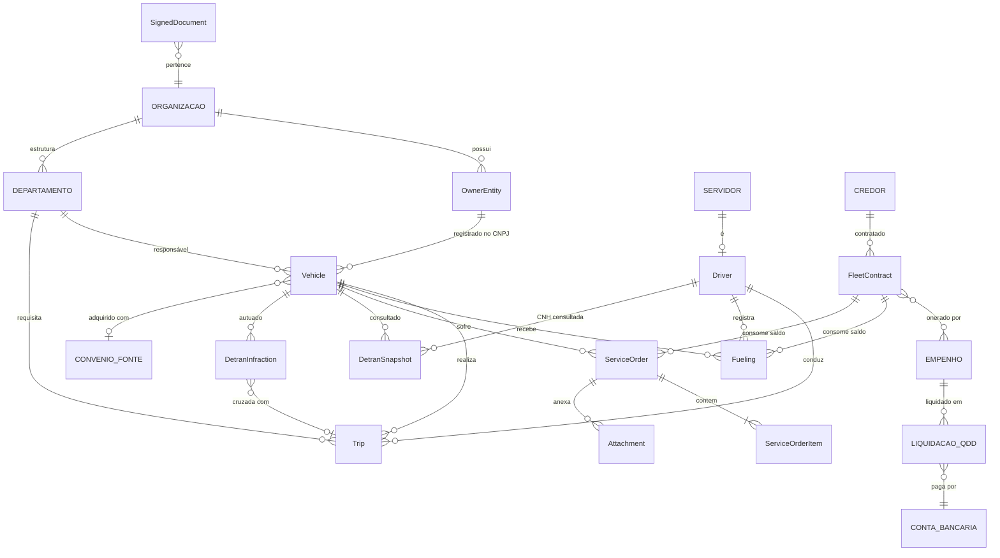
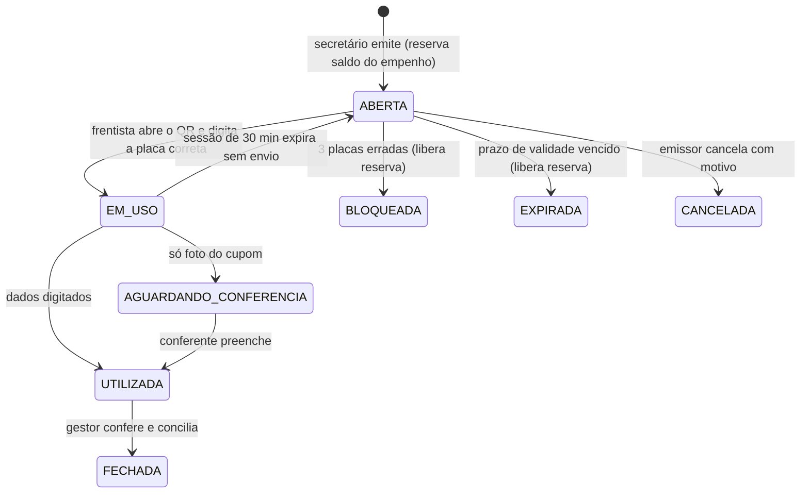

# Simplifica Frotas — Especificação Funcional e Arquitetural

Oct 2, 2026 · @Carlos Magno

## Sumário executivo

**Recomendação: construir o Simplifica Frotas como um módulo com fronteira de produto dentro do SIMP (um "monólito modular"), com o financeiro, a identidade e a auditoria acessados por portas (interfaces) e o modo integrado ou autônomo definido por contrato, por prefeitura.** Isso entrega a flexibilidade comercial da Opção C com o custo operacional da Opção A; a Opção B (microsserviço) só se paga se um cliente exigir implantação separada.

Três achados dos PDFs mudam o escopo pedido no briefing:

1. **O PDF do SERPRO não é documentação de API.** É um catálogo de campos das bases nacionais (RENAVAM, RENACH, RENAINF, RENAJUD) organizado em 5 níveis de acesso. Faltam endpoints, autenticação, preço por consulta e SLA, que dependem do contrato com o SERPRO.
2. **O catálogo não traz licenciamento (CRLV), IPVA nem débitos estaduais.** Esses dados são do Detran-TO, não do SENATRAN; precisam de outra integração ou de upload do CRLV-e.
3. **Despesa de frota não deve virar lançamento financeiro a cada abastecimento.** No setor público o fato gerador contábil é a liquidação da nota fiscal contra o empenho; o abastecimento consome saldo do empenho e a NF consolidada gera a liquidação no QDD.

O MVP cabe em cinco entidades centrais (veículo, motorista, viagem, abastecimento, ordem de serviço) mais as tabelas de apoio. As regras de consistência do guia GFI/MG viram validações e alertas desde o primeiro dia, o que dá ao produto um argumento de venda auditável perante o controle interno e o TCE-TO.

## Fontes analisadas

Cada PDF cobre uma camada diferente: o SERPRO define o que dá para consultar, o GFI define como medir e validar, a apostila define os processos operacionais.

| Fonte | O que traz | Como entra no sistema |
| --- | --- | --- |
| SERPRO — Catálogo de bases de trânsito (64 p.) | \~40 tipos de consulta (veículo, condutor, infração, RENAJUD, roubo/furto, recall, CSV) com campos por nível: 1 Básica, 2 Com indicadores, 3 Detalhada, 4 Fiscalização e Controle, 5 Com imagem | Mapeamento dos campos sincronizados; escolha mínima de níveis (1–3); chaves de consulta que garantem isolamento por prefeitura |
| Seplag-MG — Gestão de Frota por Indicadores (GFI), 23 p. | 26 indicadores em 4 temas (Dados/Situação, Abastecimento, Atendimento/Uso, Manutenção) e as regras numéricas de registro duplicado, improvável e oneroso | Validações de entrada, alertas de qualidade e o catálogo de indicadores do dashboard |
| Apostila "Introdução à gestão de frotas" (A. Dela Fuente) | Tipos de manutenção (preventiva, preditiva, corretiva, acidente/SOS, bancada, reforma, operativa, inspeção prévia), bloqueios de abastecimento, próprio × locado, diesel S10 e ARLA 32 | Enumerações, regras de bloqueio do abastecimento, plano de preventiva e checklist do condutor |
| Briefing do SIMP | Stack, padrões (soft-delete, RBAC, multi-tenant, transações atômicas) e componentes existentes | Arquitetura, contratos de integração e padrões de UI |

Nenhum dos PDFs traz layout de relatório pronto para frota municipal; os modelos da seção de relatórios foram derivados dos indicadores do GFI e da prática de prestação de contas.

## Escopo: crítico × desejável

O MVP é o que a prefeitura precisa para responder ao controle interno "quem usou qual veículo, quanto gastou e com qual empenho"; o resto entra depois sem mudar o modelo de dados.

| Fluxo | Prioridade | Justificativa |
| --- | --- | --- |
| Cadastro de veículos, entidades proprietárias e motoristas | Crítico (MVP) | Base de tudo; sem CNPJ proprietário correto, nem DETRAN nem patrimônio fecham |
| Requisição, saída e retorno de viagem (diário de bordo) | Crítico (MVP) | Comprova finalidade pública do uso; alimenta km rodado e ociosidade |
| Abastecimento com validações (hodômetro, tanque, intervalo, preço) | Crítico (MVP) | Maior fonte de desvio em frota municipal |
| Ordem de serviço de manutenção com itens e garantia | Crítico (MVP) | Peças e valores unitários exigidos na prestação de contas |
| Relatórios unitário e consolidado em PDF com assinatura | Crítico (MVP) | Exigência explícita do briefing |
| Vínculo com empenho/QDD do SIMP | Crítico no modo integrado | Diferencial de venda junto ao SIMP |
| Dashboard de indicadores (subconjunto do GFI) | Fase 2 | Depende de 2–3 meses de dados |
| Consulta SERPRO/DETRAN (veículo, restrições, infrações, CNH) | Fase 2–3 | Depende de contrato e credencial; iniciar a contratação já |
| Plano de manutenção preventiva com alertas | Fase 3 | Precisa de histórico e regras por modelo |
| Comparação com preço ANP | Fase 3 | Fonte pública semanal; útil em abastecimento por cartão |
| App do motorista (PWA offline, checklist com fotos) | Fase 3 | Conectividade irregular no interior do TO |
| Rastreamento GPS/telemetria | Fora do escopo inicial | Exige hardware e contrato próprio; integrar por API depois |

**Estrutura mínima viável de dados:** `Vehicle`, `Driver`, `Trip`, `Fueling`, `ServiceOrder` + `ServiceOrderItem`, apoiadas por `OwnerEntity` (CNPJ proprietário), `Supplier` (posto, oficina), `FleetContract` (contrato/ata) e `Attachment`. As tabelas de DETRAN, plano preventivo e indicadores entram nas fases seguintes.

## Modelo de dados

O veículo é o eixo do modelo; viagens, abastecimentos e ordens de serviço pendem dele, e todo valor em dinheiro passa por um contrato e um empenho do SIMP. As entidades do SIMP (em maiúsculas no diagrama) não são duplicadas: o Frotas guarda só a chave estrangeira.

| Relação | Cardinalidade | Regra |
| --- | --- | --- |
| Veículo → entidade proprietária | N:1 | Obrigatória para PROPRIO; o CNPJ é a chave da consulta SERPRO |
| Viagem → veículo, motorista, departamento | N:1 cada | Sem sobreposição de horário para o mesmo veículo ou motorista |
| Abastecimento / OS → contrato | N:1 | Saldo do contrato e do empenho verificado na mesma transação |
| Contrato → empenho | N:N | Um contrato pode ter vários empenhos (exercícios, fontes) |
| Liquidação → abastecimentos/itens | 1:N | Abastecimento ou item só entra em uma liquidação; estorno libera |
| Infração → viagem | N:0..1 | Cruzamento por placa, data e hora; sem viagem gera alerta |
| Veículo → convênio/fonte | N:0..1 | Permite filtrar custos de bens adquiridos com recurso vinculado |

Soft-delete em todas as tabelas; `DetranSnapshot`, `AuditEvent` e `SignedDocument` são somente inserção (append-only).

## Dicionário de campos

Todas as tabelas carregam os campos-padrão do SIMP: `id` (uuid), `organizationId` (FK, obrigatório, indexado), `createdAt`, `createdById`, `updatedAt`, `updatedById`, `deletedAt`, `deletedById`, `version` (int, controle otimista). Valores monetários em `Decimal(14,2)`; quantidades de combustível em `Decimal(10,3)`; preço unitário em `Decimal(10,4)`.

### OwnerEntity — entidade proprietária

| Campo | Tipo | Validação / regra |
| --- | --- | --- |
| name | string(200) | obrigatório |
| cnpj | string(14) | DV válido; único por organização |
| kind | enum | PREFEITURA, FUNDO\_SAUDE, FUNDO\_EDUCACAO, FUNDO\_ASSISTENCIA, CAMARA, AUTARQUIA, OUTRO |
| simpEntityId | uuid? | vínculo com a unidade gestora no SIMP (modo integrado) |

Veículos de saúde e educação costumam estar registrados no CNPJ do fundo, não da prefeitura. Sem essa tabela as consultas por proprietário no SERPRO falham.

### Vehicle — veículo

| Campo | Tipo | Validação / regra | Origem |
| --- | --- | --- | --- |
| plate | string(7) | `^[A-Z]{3}[0-9][A-Z0-9][0-9]{2}$` (antiga e Mercosul); único por organização entre ativos | manual / SERPRO |
| renavam | string(11) | 11 dígitos com dígito verificador | manual / SERPRO |
| chassis | string(17) | VIN de 17 caracteres, sem I, O, Q | manual / SERPRO |
| ownerEntityId | FK | obrigatório para veículo próprio | manual |
| ownership | enum | PROPRIO, LOCADO, CEDIDO\_RECEBIDO, CEDIDO\_ENTREGUE, COMODATO | manual |
| lessorSupplierId | FK? | obrigatório se LOCADO | manual |
| departmentId | FK | secretaria/unidade responsável (do SIMP) | manual |
| vehicleType | enum | tabela SENATRAN: AUTOMOVEL, CAMINHONETE, CAMIONETA, UTILITARIO, MOTOCICLETA, MICROONIBUS, ONIBUS, CAMINHAO, CAMINHAO\_TRATOR, REBOQUE, MAQUINA… | SERPRO "Tipo Veículo" |
| weightClass | enum (derivado) | LEVE / PESADO pela regra do GFI | calculado |
| species, category | string | "Espécie", "Categoria" (OFICIAL) | SERPRO |
| makeModel | string | "Marca/Modelo" | SERPRO |
| manufactureYear, modelYear | int | 1950 ≤ fab ≤ modelo ≤ ano atual + 1 | SERPRO |
| fuelType | enum | GASOLINA, ETANOL, FLEX, DIESEL\_S10, DIESEL\_S500, GNV, ELETRICO, HIBRIDO | SERPRO "Combustível" |
| usesArla32 | bool | obrigatório para diesel Euro 6 | manual |
| tankCapacityL | decimal | > 0; usado no bloqueio de abastecimento | manual |
| referenceKmL | decimal? | desempenho de referência do modelo | manual / tabela |
| seats, maxLoadKg, gvwKg, axles, powerCv, displacementCc | int | "Lotação", "Capacidade Máx. Carga", "PBT", "Eixos", "Potência", "Cilindradas" | SERPRO |
| color | string | "Cor" | SERPRO |
| workRegime | enum | PADRAO\_8H, INTEGRAL\_24H (ambulância, SAMU, guarda) | manual |
| status | enum | EM\_USO, RESERVA, MANUTENCAO, ACIDENTADO, PARALISADO, A\_DOAR, BAIXADO | manual / calculado |
| assetTag | string? | nº de patrimônio | manual / SIMP |
| acquisitionValue, marketValue | decimal? | valor de aquisição e valor venal (FIPE ou patrimônio) | manual |
| fundingSource | FK? | convênio/fonte que adquiriu o veículo | SIMP |
| currentOdometer | int | maior hodômetro válido registrado (desnormalizado) | calculado |
| detranSnapshotId | FK? | última consulta SERPRO | sistema |

### Driver — motorista

| Campo | Tipo | Validação / regra |
| --- | --- | --- |
| personId | FK | pessoa do SIMP (servidor) ou cadastro próprio no modo autônomo |
| cpf | string(11) | DV válido; único por organização |
| cnhNumber | string(11) | obrigatório |
| cnhCategory | enum | A, B, AB, C, D, E e combinações |
| cnhExpiry | date | bloqueia escala se vencida |
| cnhStatus | enum | REGULAR, SUSPENSA, CASSADA, DESCONHECIDA (SERPRO "Situação CNH") |
| specialCourses | json | escolar, emergência, coletivo de passageiros, produtos perigosos: data e UF (SERPRO nível 3) |
| employmentKind | enum | EFETIVO, COMISSIONADO, CONTRATADO, TERCEIRIZADO |
| active | bool |  |

### Trip — viagem (diário de bordo)

| Campo | Tipo | Validação / regra |
| --- | --- | --- |
| number | string | sequencial por organização e ano |
| vehicleId, driverId | FK | motorista com CNH válida e categoria compatível; curso especial quando o veículo exige |
| requesterDepartmentId, requesterId | FK | quem pediu |
| purpose | text | obrigatório, ≥ 15 caracteres (finalidade pública) |
| origin, destination | string | município + endereço livre |
| serviceType | enum | TRANSPORTE\_PACIENTE, TRANSPORTE\_ESCOLAR, ADMINISTRATIVO, OBRAS, FISCALIZACAO, OUTRO |
| plannedStart, plannedEnd | datetime |  |
| startAt, endAt | datetime | endAt > startAt; duração entre 4,8 min e 30 dias (GFI) |
| startOdometer, endOdometer | int | start ≥ último hodômetro do veículo; end > start; km ≤ 10.000 |
| avgSpeedKmh | decimal (derivado) | alerta fora de 1–75 km/h (GFI) |
| passengers | int / json | lista nominal opcional |
| estimatedCost | decimal (derivado) | km × custo/km do veículo no mês |
| status | enum | SOLICITADA, AUTORIZADA, EM\_CURSO, CONCLUIDA, CANCELADA |
| approvedById, approvedAt |  | autorização da chefia |

Regras de conflito: o mesmo veículo ou o mesmo motorista não pode ter duas viagens EM\_CURSO com intervalos sobrepostos.

### Fueling — abastecimento

| Campo | Tipo | Validação / regra |
| --- | --- | --- |
| vehicleId, driverId | FK | obrigatórios |
| supplierId | FK | posto (credor do SIMP) |
| contractId | FK? | contrato/ata vigente com saldo |
| commitmentId | FK? | empenho (modo integrado) |
| fuelType | enum | compatível com `Vehicle.fuelType`; ARLA\_32 permitido só se `usesArla32` |
| occurredAt | datetime | não futuro; ≥ 2 h após o abastecimento anterior do veículo (apostila) |
| odometer | int | > hodômetro anterior; ARLA e partida a frio dispensam |
| quantityL | decimal(10,3) | > 0 e ≤ `tankCapacityL` × 1,05; acima exige justificativa e liberação |
| unitPrice | decimal(10,4) | > R$ 1,00; alerta se ≥ 150% do preço máximo ANP do município/semana |
| totalAmount | decimal(14,2) | = round(quantityL × unitPrice, 2), tolerância R$ 0,01 frente à NF |
| fullTank | bool | base do cálculo de km/L tanque-a-tanque |
| channel | enum | CONTRATO\_POSTO, CARTAO, ESTOQUE\_PROPRIO, ADIANTAMENTO |
| receiptNumber | string? | cupom/NF; chave da conciliação |
| qualityFlags | enum\[\] | DUPLICADO, VALOR\_BAIXO, VALOR\_ALTO, DESEMPENHO\_IMPROVAVEL, PARTIDA\_A\_FRIO |

### ServiceOrder e ServiceOrderItem — manutenção

| Campo | Tipo | Validação / regra |
| --- | --- | --- |
| number | string | sequencial por organização e ano |
| vehicleId | FK |  |
| kind | enum | PREVENTIVA, PREDITIVA, CORRETIVA, ACIDENTE, BANCADA, REFORMA |
| workshopSupplierId | FK | oficina (credor) |
| contractId, commitmentId | FK? | contrato/ata e empenho |
| openedAt, closedAt | date | duração ≥ 1 dia e < 365 dias (GFI) |
| odometer | int | ≥ hodômetro anterior |
| diagnosis | text | obrigatório |
| invoiceNumber, invoiceKey | string? | NF-e de 44 dígitos validada |
| status | enum | ABERTA, ORCADA, APROVADA, EM\_EXECUCAO, CONCLUIDA, CANCELADA |
| **Item:** itemType | enum | PECA, SERVICO, PNEU, LUBRIFICANTE |
| **Item:** description, partCode | string |  |
| **Item:** quantity, unitPrice, total | decimal | total = qtd × preço |
| **Item:** warrantyMonths, warrantyKm | int? | alerta se a mesma peça for trocada dentro da garantia |

### Tabelas de apoio

`Supplier` (espelho do credor do SIMP), `FleetContract` (contrato ou ata: objeto, vigência, saldo por item), `Attachment` (CRLV-e, NF, fotos, checklist), `DetranSnapshot` e `DetranInfraction` (seção DETRAN), `MaintenancePlan` (regra km/meses por modelo), `QualityAlert`, `SignedDocument` e `AuditEvent`.

## Fluxos operacionais

Cada fluxo grava em uma única transação o registro, o hodômetro do veículo e o evento de auditoria; nada é apagado, só cancelado ou estornado com motivo.

### Cadastro de veículo

1. Gestor informa placa, Renavam e entidade proprietária (CNPJ).
2. Com credencial SERPRO ativa, o sistema consulta "Veículo por Proprietário, Placa e Renavam" e pré-preenche os dados técnicos; sem credencial, preenchimento manual.
3. Divergência entre o proprietário retornado e o CNPJ informado bloqueia o cadastro como PROPRIO e sugere LOCADO/CEDIDO.
4. Gestor completa capacidade do tanque, regime de trabalho, secretaria, patrimônio e valor venal.
5. Upload do CRLV-e do exercício (PDF) com data de validade.

### Viagem

1. Servidor solicita (destino, finalidade, data, passageiros).
2. Chefia da secretaria autoriza; o sistema sugere veículo livre e motorista apto.
3. Na saída: checklist do condutor (óleo, água, pneus, freios, luzes), hodômetro inicial e hora.
4. No retorno: hodômetro final, hora, ocorrências e fotos; cálculo de km, duração e velocidade média com alertas do GFI.
5. Viagem concluída fica disponível para assinatura do motorista e do responsável.

### Abastecimento

1. Motorista ou frentista registra veículo, hodômetro, litros, preço e cupom.
2. Validações bloqueantes: combustível compatível, intervalo ≥ 2 h, litros ≤ tanque + 5%, hodômetro crescente, contrato com saldo.
3. Validações de alerta (não bloqueiam): preço acima do ANP, km/L fora da faixa, possível duplicidade.
4. Bloqueio superado só com liberação do gestor e justificativa registrada.
5. No fechamento do mês, abastecimentos do posto são conciliados com a NF consolidada e enviados para liquidação (seção SIMP).

### Manutenção

1. Abertura da OS (motorista relata defeito ou o plano preventivo dispara).
2. Oficina orça itens; gestor aprova contra o saldo do contrato/ata.
3. Veículo muda para MANUTENCAO; viagens futuras são bloqueadas.
4. Execução, conferência dos itens e anexação da NF-e.
5. OS concluída: veículo volta a EM\_USO, garantia passa a valer e a NF segue para liquidação.

### Sincronização DETRAN

1. Agendador cria uma tarefa por veículo ou condutor elegível, por organização.
2. Worker consulta o SERPRO com a credencial da própria organização.
3. Resposta é gravada como snapshot imutável; mudanças viram eventos (nova infração, restrição, CNH suspensa).
4. Eventos geram alertas para o gestor e, no caso de infração, abrem o fluxo de identificação do condutor.

## Autorização de abastecimento com QR code (MVP)

O secretário emite uma autorização de uso único; o frentista a consome pelo celular, sem login e sem app, por uma rota temporária; o gestor confere. O módulo é habilitado por organização no painel admin do SIMP, como os demais.

### Ciclo de vida

### Campos da autorização (`FuelingAuthorization`)

| Campo | Tipo | Regra |
| --- | --- | --- |
| number | string | sequencial por organização e ano |
| departmentId, issuedById | FK | secretário ou delegado com alçada |
| vehicleId | FK | obrigatório: a autorização é do veículo, não só do motorista |
| driverId | FK | CNH válida e compatível |
| supplierId, contractId | FK | posto do contrato vigente |
| fuelType | enum | compatível com o veículo |
| maxLiters, maxAmount | decimal | litros e valor máximos; o registro não pode passar de nenhum dos dois |
| unitPriceCap | decimal | preço do contrato; acima disso bloqueia |
| validUntil | datetime | prazo de validade |
| purpose | text | finalidade |
| tokenHash | string(64) | SHA-256 do token do QR operacional; o token em si nunca é gravado |
| documentHash | string | hash do documento, pela função global de validação do SIMP |
| status | enum | ABERTA, EM\_USO, AGUARDANDO\_CONFERENCIA, UTILIZADA, FECHADA, EXPIRADA, CANCELADA, BLOQUEADA; plateAttempts conta as placas erradas (máximo 3) |
| usedAt, usedIp, usedUserAgent |  | evidência do uso |
| fuelingId | FK? | abastecimento gerado |

### Os dois QR codes

| QR | Conteúdo | Quem lê | Mostra |
| --- | --- | --- | --- |
| Pequeno — validação | URL de verificação global do SIMP com o hash do documento | Qualquer pessoa (fiscal, auditor) | Se o documento é autêntico, status atual e dados mínimos |
| Grande — operacional | URL `/abastecer/<token>` com token aleatório de 128 bits | Frentista | Primeiro só pede a placa; com a placa certa, mostra combustível, limites e o formulário ou o envio de foto |

### Segurança do uso único

1. Token aleatório de 128 bits; no banco só o hash. Sem IDs sequenciais na URL.
2. **Placa como chave de acesso:** ao abrir o QR, o frentista vê só um campo para digitar a placa do veículo à sua frente. A tela não exibe a placa nem dica dela. Placa diferente da cadastrada na emissão = acesso negado.
3. **Três tentativas:** na terceira placa errada, a autorização vai para BLOQUEADA de forma definitiva, a reserva de saldo é liberada e o emissor é notificado. Para abastecer, é preciso emitir nova autorização. O contador fica no banco (não no navegador), então trocar de celular não zera as tentativas.
4. A comparação ignora hífen, espaço e maiúsculas/minúsculas e aceita a conversão antiga ↔ Mercosul da mesma placa, para não bloquear por digitação de formato.
5. Com a placa certa, a autorização passa para EM\_USO numa atualização atômica (`UPDATE … WHERE status = 'ABERTA' RETURNING`) e fica presa àquele celular por um cookie de sessão de 30 min. Um segundo aparelho recebe "autorização já em uso".
6. O envio grava o abastecimento e fecha o token na mesma transação. Depois disso a rota só serve o comprovante para download por 24 h, e então expira.
7. Limites de taxa na rota pública e nenhuma exposição de CPF; o motorista aparece só pelo nome.

Limite conhecido: a placa barra quem achou ou fotografou o papel, mas não impede que o próprio motorista abasteça outro veículo digitando a placa autorizada. Esse caso é pego depois, pelo hodômetro e pelo km/L fora da faixa.

### Foto do cupom

- Compressão no próprio celular antes do envio (lado maior 1.600 px, WebP), o que poupa dados móveis no interior. No servidor, nova conversão para WebP qualidade \~70, remoção dos metadados EXIF e hash SHA-256. Alvo: 100–200 KB por foto, legível.
- Para o PDF, gera-se uma miniatura JPEG, porque nem toda biblioteca de PDF aceita WebP.
- **Quando o cupom for NFC-e, ler o QR code impresso nele:** a chave de 44 dígitos traz o CNPJ do posto, a UF e o mês de emissão. O sistema confere se o posto é o do contrato e bloqueia a mesma chave usada duas vezes — a fraude mais comum com cupom.
- Litros e valor podem ser sugeridos por OCR, mas sempre confirmados pelo conferente, que recebe a notificação na tela do SIMP.

### Relatórios

Dois modelos: só dados, ou dados com a foto ao lado de cada abastecimento. Sem foto, a coluna mostra "Sem cupom fiscal anexado", e o relatório totaliza quantas autorizações ficaram sem comprovante.

## Regras de qualidade e indicadores (base GFI/MG)

O GFI calcula indicadores sobre dados já gravados e por isso descarta registros ruins depois; o Simplifica Frotas aplica as mesmas regras na entrada, marcando o registro com `qualityFlags` em vez de descartá-lo.

### Regras de consistência

| Regra | Critério (GFI ou apostila) | Ação no sistema |
| --- | --- | --- |
| Abastecimento duplicado | Mesma placa, consecutivo, hodômetro com diferença ≤ 1 km e volume ≤ 1 L | Bloqueia; liberação do gestor |
| Valor unitário baixo | ≤ R$ 1,00 por litro | Bloqueia |
| Valor unitário alto | ≥ 150% do preço máximo ANP no município e mês | Alerta |
| Partida a frio | Mesmo veículo e data, mesmo hodômetro, gasolina, ≤ 2 L | Aceita, fora do km/L |
| Desempenho improvável | km/L mais de 50% abaixo ou mais de 150% acima da referência do modelo | Alerta |
| Intervalo entre abastecimentos | < 2 horas (apostila) | Bloqueia |
| Capacidade do tanque | Litros acima da capacidade | Bloqueia; liberação com justificativa |
| Atendimento improvável | km ≤ 0 ou ≥ 10.000; duração ≤ 4,8 min ou ≥ 30 dias; velocidade ≤ 1 ou ≥ 75 km/h | Alerta; fora de horas trabalhadas |
| Confiabilidade do km | km das viagens ÷ km entre abastecimentos fora de 80–120% no mês | Alerta mensal por veículo |
| Manutenção improvável | Valor < R$ 1,00; km entre manutenções ≤ 0 ou ≥ 100.000; duração negativa, < 1 dia ou ≥ 365 dias; 1 dia com valor > R$ 500 (leve) ou > R$ 1.000 (pesado); concomitante a outra | Alerta |
| Veículo oneroso | Manutenção dos últimos 12 meses > 40% do valor venal (próprios) | Alerta e relatório para decisão de baixa |
| Paralisado | Sem viagem, abastecimento ou manutenção há 30 dias / 12 meses | Alerta; status sugerido |

Veículos leves: ciclomotor, motoneta, motocicleta, automóvel, camioneta, caminhonete e utilitário. Pesados: micro-ônibus, ônibus, reboque, caminhão, caminhão trator e motor-casa.

### Indicadores adotados

| Tema | Indicador | Fórmula | Fase |
| --- | --- | --- | --- |
| Situação | Frota ativa por tipo e posse | contagem por `vehicleType` × `ownership` | MVP |
| Situação | Idade média (geral e leves) | média de (ano atual − ano de fabricação) | MVP |
| Situação | % paralisados 30 dias / 12 meses | paralisados ÷ frota ativa | 2 |
| Uso | km rodado | Σ (hodômetro final − inicial) das viagens válidas | MVP |
| Uso | % ociosidade | 1 − horas em viagem ÷ horas disponíveis (8 h × dias úteis ou 24 h × dias do mês, por veículo) | 2 |
| Uso | % viagens improváveis | viagens com alerta ÷ total | 2 |
| Abastecimento | Consumo em litros e R$ | Σ por veículo, secretaria, fonte | MVP |
| Abastecimento | km/L por veículo | km entre tanques cheios ÷ litros | 2 |
| Abastecimento | % acima do ANP | abastecimentos com alerta de preço ÷ total | 3 |
| Manutenção | Gasto total e gasto médio por veículo (geral e leves) | Σ OS concluídas ÷ veículos com OS | MVP |
| Manutenção | % manutenções improváveis | OS com alerta ÷ total | 2 |
| Manutenção | % veículos onerosos | onerosos ÷ próprios com valor venal | 2 |
| Custo | Custo por km | (combustível + manutenção) ÷ km | 2 |

Diferente do GFI, que publica com quatro meses de defasagem por depender de vários sistemas, aqui o dado é de primeira mão: os indicadores são do mês corrente, com "competência fechada" após a conciliação das NFs.

## Integração DETRAN (bases SENATRAN via SERPRO)

A integração é com o WSDenatran (Consulta Online Senatran), API REST do SERPRO sobre RENAVAM, RENACH e RENAINF; o PDF anexado é o catálogo de campos dessa API. O acesso exige termo de autorização da SENATRAN, contrato com o SERPRO e certificado digital cadastrado pelo SERPRO ([Conecta gov.br — WSDenatran](https://www.gov.br/conecta/catalogo/apis/wsdenatran)). Endpoints, Swagger e preço por consulta só chegam com o contrato; esta seção define o lado do Simplifica Frotas.

### Consultas a contratar (níveis 1 a 3 apenas)

| Consulta do catálogo | Nível | Chave de entrada | Uso no sistema |
| --- | --- | --- | --- |
| Veículo por Proprietário, Placa e Renavam | 1 e 2 | CNPJ proprietário + placa + Renavam | Cadastro e restrições: situação, baixa, RENAJUD, RFB, roubo/furto, recall, multa RENAINF, pendência de CRV |
| Infração por Proprietário, Placa e Renavam | 1 a 3 | CNPJ + placa + Renavam | Multas: AIT, código, data/hora, local, órgão autuador, valor, vencimento |
| Infração por Placa e Exigibilidade | 3 | placa | Prazos: limite de defesa, notificação de penalidade, infrator apresentado |
| Renajud Ativas por Placa e Renavam | 2 e 3 | placa + Renavam | Tribunal, tipo de restrição, processo |
| Recall Veículo por Chassi | 1 | chassi | Abrir OS de recall sem custo |
| Condutor por CPF e Número Registro CNH | 1 e 2 | CPF + nº CNH | Validade, categoria, situação da CNH (suspensa, cassada) |
| Condutor por CPF (campos de cursos) | 3 | CPF | Cursos de transporte escolar, emergência e coletivo de passageiros |

Não contratar o nível 4 (Fiscalização e Controle, com endereços) nem o 5 (biometria, assinatura e retrato): não têm finalidade na gestão de frota e aumentam o risco sob a LGPD. Do nível 3 de condutor, gravar só os campos de curso e descartar endereço e filiação.

### O que o catálogo não cobre

Licenciamento anual (CRLV do exercício), IPVA, taxas e débitos são do Detran-TO. Até haver integração estadual, o sistema guarda o CRLV-e em PDF com a data de validade e alerta 30 dias antes.

### Isolamento entre prefeituras

1. **Credencial por organização.** Cada prefeitura (controladora dos dados) tem seu certificado e contrato; a CM Conecta atua como operadora. Segredos em cofre (KMS), cifrados com chave por organização, nunca em variável de ambiente compartilhada.
2. **A consulta prova a posse.** As consultas de veículo e infração exigem o CNPJ proprietário; o worker só aceita CNPJs da tabela `OwnerEntity` da própria organização. Uma prefeitura não consegue consultar placa alheia nem por erro de digitação.
3. **Condutor só com vínculo.** CPF consultado apenas se houver `Driver` ativo na organização.
4. **Dados gravados com `organizationId`** e protegidos por Row-Level Security no PostgreSQL, além do filtro do Prisma.
5. **Toda consulta auditada:** quem disparou, finalidade, chave consultada, hash da resposta.

### Frequência de sincronização

| Dado | Frequência | Gatilho extra |
| --- | --- | --- |
| Dados técnicos do veículo | No cadastro e a cada 6 meses | Mudança de placa ou proprietário |
| Restrições, roubo/furto, RENAJUD | Semanal | Antes de autorizar viagem intermunicipal |
| Infrações | Semanal | Sob demanda pelo gestor |
| CNH do motorista | Mensal | Validade a ≤ 30 dias; antes de escalar para veículo que exige curso |
| Recall | Trimestral | Cadastro do veículo |

Com frota de 80 veículos e 60 motoristas, isso dá cerca de 800 consultas por mês; o custo unitário do contrato define se a frequência pode subir.

### Tratamento de erros

- Fila (BullMQ sobre Redis) com uma fila lógica por organização, para que uma prefeitura com credencial vencida não trave as demais.
- Retentativa exponencial (1 min, 5 min, 30 min, 2 h), depois fila morta com alerta ao gestor.
- Disjuntor por credencial: 5 falhas de autenticação seguidas suspendem a credencial e avisam o administrador.
- Idempotência: chave = organização + tipo de consulta + chave + dia.
- Resposta bruta guardada cifrada por 5 anos, com hash SHA-256 no snapshot; o snapshot nunca é sobrescrito.

### Fluxo de multa → condutor

Cada nova infração é cruzada com as viagens do veículo pela data e hora da infração. Havendo viagem, o sistema sugere o motorista e o prazo ("Autuação Data Limite Defesa") e gera o formulário de identificação do condutor infrator para assinatura. Sem viagem no horário, a infração vira alerta de uso não registrado — um achado de controle interno.

## Integração com o SIMP

O Frotas nunca escreve direto nas tabelas financeiras do SIMP: ele chama uma porta `FinancePort` cujo adaptador, no modo integrado, usa os serviços do motor QDD dentro da mesma transação. Assim o módulo respeita as fases da despesa (empenho → liquidação → pagamento) e o mesmo código funciona no modo autônomo.

### Vínculo financeiro

| Evento de frota | O que acontece no SIMP | Quando |
| --- | --- | --- |
| Cadastro de contrato/ata de combustível, peças ou serviços | `FleetContract` aponta para o contrato e para os empenhos do SIMP (estimativo ou global) | Na contratação |
| Abastecimento ou OS aprovada | Reserva de saldo do empenho (`reserveCommitment`) — não é lançamento contábil | Na hora do registro |
| NF do posto (mensal) ou NF da oficina conciliada | Liquidação no QDD com dotação, natureza (3.3.90.30 material de consumo; 3.3.90.39 serviços de terceiros) e subelemento do plano de contas do TCE-TO; anexos e lista de abastecimentos/itens | No fechamento ou na conclusão da OS |
| Pagamento | Continua no fluxo financeiro do SIMP, com a conta bancária escolhida via `BankAccountCombobox` | Fora do Frotas |
| Estorno/cancelamento | Libera a reserva ou estorna a liquidação com motivo | Na ação do gestor |

A conta bancária é sempre a do empenho/fonte de recurso. Isso importa quando o combustível é pago com recurso vinculado (transporte escolar, fundo de saúde, convênio): o veículo e a viagem guardam a fonte, e o relatório de prestação de contas filtra por ela.

### Permissões (RBAC)

| Papel | Pode |
| --- | --- |
| Administrador de frota | Tudo na organização, inclusive liberar bloqueios e configurar DETRAN |
| Gestor da secretaria | Veículos e viagens da sua secretaria; aprovar requisições e OS até o limite de alçada |
| Motorista | Ver as próprias viagens; registrar saída, retorno, checklist e abastecimento |
| Frentista / posto conveniado | Registrar abastecimento do contrato, sem ver outros dados |
| Financeiro | Conciliar NFs e enviar para liquidação |
| Controle interno / auditor | Somente leitura, com acesso à trilha de auditoria |

Permissões seguem o padrão do SIMP (`fleet.vehicle.read`, `fleet.fueling.release_block` etc.) e o escopo por secretaria usa a árvore de departamentos do SIMP, sem cadastro paralelo.

### Auditoria

Toda escrita gera um `AuditEvent` na mesma transação: ator, ação, entidade, estado antes/depois (JSON), IP, motivo. Os eventos encadeiam o hash do anterior por organização, o que torna adulteração detectável; o controle interno consegue provar que o hodômetro de março não foi editado em junho.

## Relatórios, dashboard e assinatura digital

Todo relatório é gerado como PDF/A imutável, com os filtros aplicados impressos no cabeçalho e um bloco de assinaturas no rodapé; editar o dado depois gera nova versão, nunca altera o documento assinado.

### Catálogo de relatórios

| Relatório | Tipo | Filtros | Signatários sugeridos |
| --- | --- | --- | --- |
| Ficha do veículo (cadastro, situação DETRAN, histórico) | Unitário | veículo, período | Gestor de frota |
| Diário de bordo / viagens do veículo | Unitário | veículo, motorista, período, tipo de serviço | Motorista, gestor da secretaria |
| Extrato de abastecimentos com km/L | Unitário e consolidado | veículo, motorista, posto, combustível, contrato, empenho, período | Gestor de frota, fiscal do contrato |
| Histórico de manutenção com peças e garantias | Unitário | veículo, oficina, tipo, período | Gestor de frota |
| Consolidado de custos por secretaria | Consolidado | secretaria, fonte de recurso, conta, período | Secretário, gestor de frota |
| Relação de despesas para liquidação (anexo da NF) | Consolidado | contrato, empenho, competência | Fiscal do contrato, ordenador |
| Infrações e identificação de condutor | Unitário | veículo, motorista, situação | Motorista, gestor |
| Alertas de qualidade de dados | Consolidado | tipo de alerta, secretaria, período | Controle interno |
| Veículos onerosos e paralisados | Consolidado | secretaria, posse, idade | Gestor de frota, secretário de administração |

Filtros comuns a todos: veículo, motorista, data, tipo de serviço, oficina, conta de pagamento, secretaria e fonte de recurso. A tela usa a mesma barra de filtros do dashboard; "Gerar PDF" grava exatamente os filtros ativos.

### Layout padrão do PDF

1. Cabeçalho: brasão, nome e CNPJ da entidade, secretaria, título, período e filtros aplicados.
2. Corpo: tabela com totais por grupo; gráfico opcional na primeira página do consolidado.
3. Rodapé de cada página: "Gerado em dd/mm/aaaa hh:mm por \<usuário>", página x de y, código de verificação.
4. Última página: bloco de assinaturas (nome, cargo, CPF mascarado, data) e QR code para a página pública de verificação.

### Dashboard

Cartões no topo: frota ativa (próprios / locados / cedidos), km rodado no mês, custo total e custo por km, manutenções abertas e preventivas vencidas, infrações pendentes com prazo, CNHs vencendo em 30 dias. Abaixo: custo mensal por secretaria, km/L por veículo contra a referência, ociosidade e a lista de alertas de qualidade. Clicar em um elemento filtra o painel inteiro, como no GFI.

### Assinatura digital

- **Assinatura eletrônica avançada gov.br** (Lei 14.063/2020) para atos internos do dia a dia: diário de bordo, checklist, relatórios de controle.
- **Assinatura qualificada ICP-Brasil (A1/A3)** para documentos que instruem processo de pagamento ou prestação de contas.
- Formato PAdES, múltiplos signatários em ordem definida, hash SHA-256 do PDF guardado em `SignedDocument`.
- Fluxo: gerar → enviar para assinatura → cada signatário assina → documento selado; recusa exige motivo.
- No modo integrado, reutiliza o serviço de assinatura dos processos virtuais do SIMP pela `SignaturePort`.

## Componentes de interface e API

Os componentes seguem o desenho de `CategoryCombobox`, `BankAccountCombobox` e `SimpleFormDialog`: busca assíncrona com TanStack Query, validação Zod compartilhada entre frontend e backend, e o mesmo componente servindo cadastro e filtro.

### Componentes

| Componente | Base | Comportamento |
| --- | --- | --- |
| `VehicleCombobox` | CategoryCombobox | Busca por placa, modelo ou patrimônio; mostra status e hodômetro; esconde veículos em manutenção conforme contexto |
| `DriverCombobox` | CategoryCombobox | Desabilita motorista com CNH vencida, suspensa ou sem categoria/curso para o veículo escolhido |
| `SupplierCombobox` | CategoryCombobox | Credor do SIMP filtrado por tipo (posto, oficina, locadora) |
| `CommitmentCombobox` | BankAccountCombobox | Empenho com saldo disponível e reservado; bloqueia saldo insuficiente |
| `BankAccountCombobox` | reuso direto | Conta de pagamento vinculada à fonte do empenho |
| `PlateInput`, `RenavamInput`, `ChassisInput`, `CpfInput`, `NfeKeyInput` | input com máscara | Máscara e dígito verificador no cliente, repetidos no servidor |
| `OdometerInput` | input numérico | Mostra o último hodômetro e avisa salto acima de 2.000 km |
| `FuelingFormDialog`, `TripStartDialog`, `TripEndDialog`, `ServiceOrderDialog` | SimpleFormDialog | Formulários com alertas de qualidade inline e campo de justificativa quando há bloqueio |
| `QualityFlagBadge`, `DetranStatusBadge`, `SignatureStatusBadge` | badge shadcn | Estado visível em listas e fichas |
| `FleetFilterBar` | novo | Filtros comuns de relatório e dashboard, serializados na URL |
| `SignDocumentDialog` | SimpleFormDialog | Escolhe signatários, ordem e tipo de assinatura |

### Endpoints principais

| Método e rota | Função |
| --- | --- |
| `GET/POST /fleet/vehicles`, `GET/PATCH/DELETE /fleet/vehicles/:id` | CRUD com soft-delete |
| `POST /fleet/vehicles/:id/detran-sync` | Enfileira consulta SERPRO do veículo |
| `GET/POST /fleet/drivers`, `POST /fleet/drivers/:id/cnh-check` | Motoristas e validação de CNH |
| `POST /fleet/trips`, `POST /fleet/trips/:id/approve`, `/start`, `/finish`, `/cancel` | Ciclo da viagem como transições de estado |
| `POST /fleet/fuelings`, `POST /fleet/fuelings/:id/release` | Abastecimento e liberação de bloqueio |
| `POST /fleet/fuelings/reconcile` | Conciliação com NF da competência |
| `POST /fleet/service-orders`, `/:id/items`, `/:id/approve`, `/:id/close` | Ordem de serviço |
| `GET /fleet/infractions`, `POST /fleet/infractions/:id/identify-driver` | Multas e identificação de condutor |
| `GET /fleet/dashboard?from&to&departmentId` | Indicadores |
| `POST /fleet/reports/:type` (assíncrono) → `GET /fleet/reports/jobs/:id` | Geração de PDF |
| `POST /documents/:id/signatures` | Assinatura (serviço do SIMP) |

### Portas internas (o que muda entre modo integrado e autônomo)

| Porta | Integrado (SIMP) | Autônomo |
| --- | --- | --- |
| `IdentityPort` | Autenticação e RBAC do SIMP | Mesmo serviço do SIMP, com tenant sem os módulos financeiros |
| `OrgPort` | Departamentos, credores e servidores do SIMP | Cadastro simplificado próprio |
| `FinancePort` | Reserva e liquidação no QDD | Registro de despesa sem contabilidade + exportação CSV/XLSX para o ERP da prefeitura |
| `SignaturePort` | Assinatura dos processos virtuais | Mesmo serviço, cobrado à parte |
| `AuditPort` | Trilha do SIMP | Mesma trilha |
| `DetranPort` | Adaptador WSDenatran | Igual |

## Segurança, LGPD e conformidade

O isolamento entre prefeituras tem duas camadas independentes: o filtro por `organizationId` aplicado por uma extensão do Prisma e políticas de Row-Level Security no PostgreSQL, ativadas por `SET LOCAL app.organization_id` no início de cada transação. Um bug na aplicação não vaza dados porque o banco recusa a linha.

- **Unicidade por organização:** placa, Renavam e CPF são únicos dentro da organização entre registros ativos (índice parcial `WHERE deleted_at IS NULL`), porque um veículo doado pode existir em duas prefeituras ao longo do tempo.
- **Transações atômicas:** registro + atualização de hodômetro + reserva de empenho + auditoria em uma transação; falha em qualquer parte desfaz tudo.
- **Concorrência:** campo `version` para impedir que dois usuários fechem a mesma OS ou viagem.
- **LGPD:** a prefeitura é controladora e a CM Conecta operadora (cláusula no contrato SaaS). Base legal: execução de políticas públicas e cumprimento de obrigação legal. Dados de CNH e infrações visíveis só ao gestor de frota e ao próprio motorista; CPF mascarado em relatórios; retenção alinhada à tabela de temporalidade documental do município.
- **Credenciais externas:** certificado do SERPRO em cofre com chave por organização; rotação e alerta de vencimento 30 dias antes.
- **Evidência para auditoria:** trilha encadeada por hash, documentos assinados com hash guardado, snapshots DETRAN imutáveis.
- **Conformidade administrativa:** finalidade obrigatória em toda viagem, vedação de uso fora do horário configurável com justificativa, e relatório de veículos usados sem viagem registrada (cruzamento com abastecimentos e multas).

## Análise arquitetural: Opções A, B e C

A melhor resposta é uma quarta via: o código da Opção A (mesmo repositório, banco e deploy do SIMP), com a fronteira interna da Opção C (portas e adaptadores), e o modo decidido por contrato e configuração da organização — não detectado em tempo de execução.

| Critério | A — Módulo integrado | B — Microsserviço | C — Dual-mode com detecção em runtime | Recomendada — monólito modular com portas |
| --- | --- | --- | --- | --- |
| Velocidade até o MVP | Alta: reusa auth, QDD, componentes | Baixa: auth entre serviços, contratos de API, dois deploys | Baixa: dois caminhos para cada regra | Alta: as portas custam poucas interfaces a mais |
| Venda separada | Fraca: Frotas só existe junto do SIMP | Forte | Forte | Forte: licença por módulo; modo autônomo é configuração |
| Escalabilidade | Suficiente: frota municipal gera milhares de linhas/mês, não milhões | Alta, mas desnecessária neste volume | Alta | Suficiente; o pacote pode virar serviço depois sem reescrever o núcleo |
| Custo operacional | Menor: um banco, um deploy, um monitoramento | Maior: 2 bancos, rede, filas, consistência eventual | Maior: duas topologias a testar | Igual ao A |
| Consistência financeira | Transação única com o QDD | Eventual; exige saga/estorno | Varia por modo | Transação única no modo integrado |
| Manutenção | Risco de acoplamento com tabelas do SIMP | Contratos versionados | Pior: comportamento muda conforme disponibilidade do SIMP | Acoplamento só pelas portas; testes rodam nos dois adaptadores |
| Venda conjunta | Natural | Possível | Possível | Natural |

**Por que não detectar o SIMP em tempo de execução (Opção C como descrita):** se o SIMP ficar fora do ar, o módulo passaria a gravar despesa "autônoma" que depois não concilia com o QDD. Modo é decisão administrativa, não estado de rede.

**Critérios que mais pesam aqui:** velocidade de implementação (equipe pequena, primeiro cliente piloto) e consistência financeira (é o que o controle interno e o TCE cobram). Flexibilidade de venda vem logo depois e é preservada pelas portas.

**Quando migrar para B:** se um cliente exigir implantação em infraestrutura própria, ou se a carga de consultas DETRAN/relatórios justificar workers isolados. O desenho por portas faz dessa mudança uma extração, não uma reescrita.

&#91;embedded content: arquitetura recomendada · núcleo, 5 portas, 2 modos de adaptador\]

O núcleo só conhece as portas; trocar o conjunto de adaptadores é o que separa o cliente SIMP do cliente que compra apenas o Frotas, e a consulta DETRAN é igual nos dois.

## Roadmap e pontos em aberto

O caminho crítico não é código: é o contrato com o SERPRO e o termo da SENATRAN, que devem começar na primeira semana para não segurar a Fase 3.

### Fases

1. **Fase 0 — Fundações.** Pacote `fleet` no monorepo do SIMP, portas definidas, `OwnerEntity`, RLS, licenciamento de módulo por organização. Em paralelo: pedido de autorização à SENATRAN e proposta do SERPRO. *Gate:* teste de isolamento entre duas organizações passando.
2. **Fase 1 — MVP operacional.** Veículos, motoristas, viagens, abastecimento e OS com as validações bloqueantes; relatórios unitário e consolidado com assinatura. *Gate:* uma prefeitura piloto registrando um mês inteiro.
3. **Fase 2 — Financeiro e indicadores.** Reserva de empenho, conciliação de NF e liquidação no QDD; dashboard com os indicadores de fase 2. *Gate:* primeira competência liquidada pelo módulo.
4. **Fase 3 — DETRAN e inteligência.** Adaptador WSDenatran, fluxo multa → condutor, preço ANP, plano preventivo, PWA do motorista. *Gate:* credencial SERPRO em produção.
5. **Fase 4 — Venda autônoma.** Adaptador financeiro de exportação para outros ERPs e onboarding sem SIMP financeiro.

### Onde os PDFs divergem do briefing

| # | Ponto | Briefing pressupõe | O que os PDFs mostram | Decisão proposta |
| --- | --- | --- | --- | --- |
| 1 | Documentação DETRAN | API documentada | Catálogo de campos, sem endpoints | Pedir Swagger do WSDenatran após o termo de autorização |
| 2 | CRLV e licenciamento | Vem do DETRAN | Não está no catálogo SENATRAN | Upload do CRLV-e; avaliar integração com o Detran-TO |
| 3 | Lançamento automático no QDD | A cada despesa | Setor público liquida por NF | Reserva no registro, liquidação na NF |
| 4 | Regime de ociosidade | Por órgão (GFI) | Ambulância municipal opera 24 h numa secretaria de 8 h | Regime por veículo |
| 5 | Desempenho improvável | — | "Mais de 150% acima" é ambíguo no GFI | Adotar > 2,5× a referência, configurável |
| 6 | Proprietário do veículo | Prefeitura | Consultas exigem o CNPJ registrado, muitas vezes do fundo | `OwnerEntity` com vários CNPJs |
| 7 | Valor venal | — | Necessário para o indicador de oneroso, sem fonte nos PDFs | Campo manual ou tabela FIPE na Fase 3 |
| 8 | Defasagem dos indicadores | — | GFI usa 4 meses por depender de terceiros | Mês corrente + competência fechada |
| 9 | Biometria e endereço do condutor | — | Disponíveis nos níveis 4 e 5 | Não contratar |

### Perguntas em aberto

- [ ] Quem contrata o SERPRO: cada prefeitura ou a CM Conecta em nome delas?
- [ ] O SIMP já tem serviço de assinatura ICP-Brasil nos processos virtuais, ou só gov.br?
- [ ] Qual o nível de subelemento exigido pelo TCE-TO para combustível, peças e serviços de veículos?
- [ ] Existe integração disponível com o Detran-TO para licenciamento e IPVA?
- [ ] Qual prefeitura será piloto e qual o tamanho da sua frota?

Fontes externas consultadas: [Conecta gov.br — WSDenatran](https://www.gov.br/conecta/catalogo/apis/wsdenatran).
