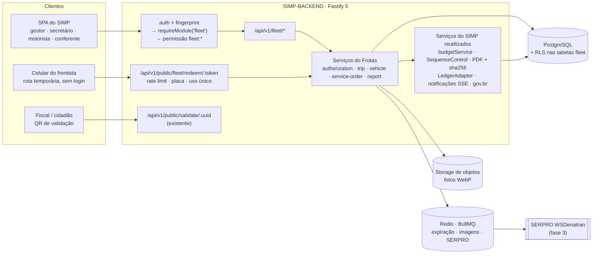
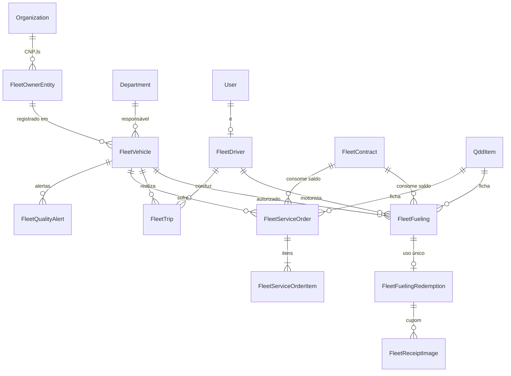
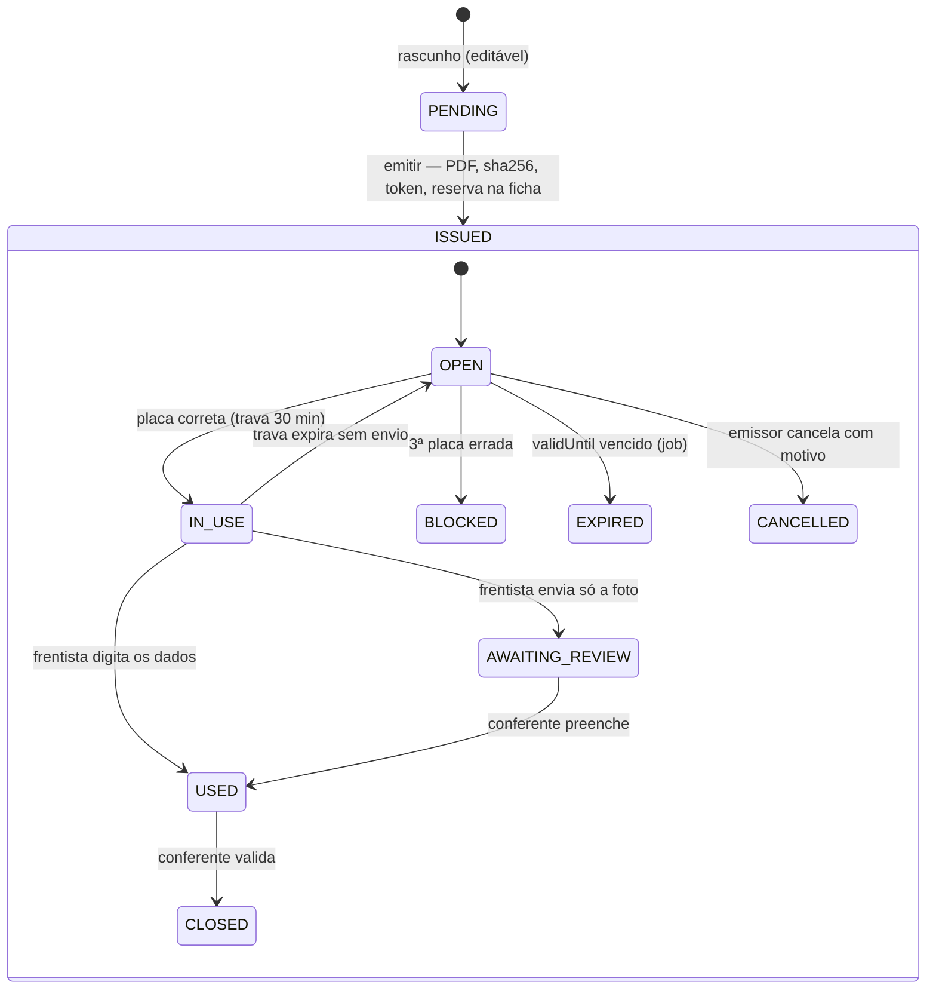

# Simplifica Frotas — Especificação Técnica de Desenvolvimento

Oct 2, 2026 · @Carlos Magno · base: documentação técnica do SIMP (branch `develop`, 02/10/2026) e especificação funcional do Simplifica Frotas

## Sumário e decisões

O SIMP já tem quase toda a infraestrutura que o Frotas precisa — inclusive um esboço do próprio módulo (`fleetFuelings`, modelo `FleetFueling`). O Frotas deve **substituir esse esboço**, como domínio novo dentro do `SIMP-BACKEND`/`SIMP-FRONTEND`, sem serviço separado, sem banco separado e sem reimplementar autenticação, hash, PDF, auditoria, notificação ou assinatura.

A leitura do código muda seis pontos da especificação funcional anterior:

| # | O que a especificação funcional supunha | O que o SIMP faz hoje | Decisão |
| --- | --- | --- | --- |
| 1 | Backend Express genérico | Fastify 5 + Zod + Prisma, com `setErrorHandler` central | Rotas do Frotas como plugin Fastify, mesmos schemas Zod |
| 2 | Abastecimento como registro novo | `FleetFueling` já existe, com ciclo `PENDING → ISSUED` (PDF + `sha256Hash` + `publicId`) | O `FleetFueling` atual (praticamente vazio) é apagado e recriado do zero como autorização de abastecimento, mantendo o nome e o ciclo `PENDING → ISSUED` das Diárias; o uso vira registro filho, como `DailyAllowanceReceipt` |
| 3 | Reserva sobre um empenho | Não existe entidade de empenho; o saldo da ficha QDD é calculado na leitura somando os consumidores | Frotas vira mais um consumidor da ficha em `budgetService.getBalancesForItems`; nº do empenho como texto |
| 4 | Bloquear saldo insuficiente | Estourar a ficha nunca bloqueia, só grava `budgetOverrun: true` | Ficha QDD: alerta. Saldo do **contrato/ata**: bloqueia (limite legal) |
| 5 | Permissões `fleet.vehicle.read` | Formato `dominio:acao`, catálogo sincronizado por `ensureAdminRole` | `fleet:...` (lista na TASK 1) |
| 6 | OCR no servidor para cupom | Fila de OCR existe mas está desligada (instável e cara) | Ler o QR da NFC-e no navegador; sem OCR de servidor no MVP |

Prioridade de entrega: TASK 1 → 2 → 3 (autorização com QR, maior dor e já meio pronta) → 5 e 6 em paralelo → 4, 7, 8 → 9 e 10 antes do go-live.

## Fase 1 — Análise do SIMP

O SIMP é um monólito modular de verdade: um processo Fastify, um PostgreSQL, isolamento por `organizationId`, módulos ligados por organização e um documento oficial padrão (registro numerado → emitido → imutável com hash). O Frotas herda esse esqueleto inteiro.

### Estrutura organizacional e acesso

- **Organization** é a raiz; quase todo modelo carrega `organizationId` e toda listagem filtra por ele. `Organization.isActive = false` derruba a organização inteira (cache de 60 s).
- **OrganizationModule** liga/desliga cada módulo; `requireModule(nome)` no backend (cache 5 min, `403 MODULE_DISABLED`) e `ModuleGate` no frontend. `fleetFuelings` já está no catálogo como módulo habilitado por contrato.
- **Department** (id `nanoid()`) é o eixo de orçamento, diárias, processos e convênios; tem `managerId` (ordenador de despesa) e um dossiê PDF com aba "Abastecimentos" que já existe.
- **RBAC:** `Role.permissions` como `dominio:acao`; permissões efetivas = união das roles; `isSuperAdmin` e `system:admin` são bypass; o banco é reconsultado em toda requisição (o JWT nunca é fonte de verdade).
- **Admin/Super Admin:** cria organização em uma transação, liga módulos, suspende, faz impersonação (o token impersonado carrega as permissões reais do admin).

### Orçamento (QDD)

O QDD é o orçamento detalhado da prefeitura em fichas (fonte + natureza de despesa). Só `valorOrcado` é gravado; o saldo é calculado na leitura subtraindo diárias emitidas, processos virtuais e convênios. Vínculos copiam a dotação como texto (`qddFichaSnapshot`, `qddFonteSnapshot`, `qddNaturezaSnapshot`). Estouro nunca bloqueia. `BudgetHistory` registra toda mudança de orçado.

### Componentes reutilizáveis

| Mecanismo | Onde está | Uso no Frotas |
| --- | --- | --- |
| Documento oficial com ciclo PENDING → ISSUED, PDF + `sha256Hash`, imutável no backend | Diárias / `FleetFueling` | Autorização de abastecimento, ordem de serviço, diário de bordo |
| `publicId` separado da PK + `ExportedDocument` + `/api/v1/public/validate/:uuid` sem PII | Portal Público | QR pequeno de validação |
| Numeração sequencial em transação Serializable com retry (`SequenceControl`) | Protocolos | Nº de autorização, OS, viagem |
| Motor de relatório compartilhado (dossiê; seção não pedida é omitida) | Departamentos | Relatórios do Frotas e aba no dossiê |
| Assinatura gov.br (`SignatureRequest`, landing de retorno) | Conselhos | Assinatura de relatórios e diário de bordo |
| `AuditLog` via `LedgerAdapter` (`record`/`query`) + trigger que bloqueia UPDATE/DELETE | Auditoria | Toda ação do Frotas |
| Notificações SSE com fallback de polling | Shell | Aviso de cupom para conferir, bloqueio, vencimentos |
| BullMQ (email, document) + node-cron | Jobs | Expiração de autorizações, alertas de CNH/CRLV, sincronização SERPRO |
| Rate limit por `request.ip`, honeypot, Turnstile, config Zod fail-fast | Segurança | Rota pública do frentista |
| `toTitleCase`/`collapseWhitespace` contra duplicatas | Processos Virtuais | Cadastro de modelos, postos, oficinas |
| `Beneficiary` como autocomplete, nunca fonte de verdade | Diárias | Motoristas eventuais e passageiros |
| `Holiday` por organização | Feriados | Dias úteis no cálculo de ociosidade |
| Camada `src/lib/api/x.ts` + `src/hooks/useX.ts`; `responseType: "blob"` | Frontend | Mesma estrutura para `fleet` |

### Limitações e riscos herdados

- **IDs mistos (`cuid`, `nanoid`):** validar `departmentId` com `.uuid()` quebra; usar `z.string().min(1)` ou o validador já usado em Departamentos.
- **Prefixo de rotas inconsistente:** alguns domínios sob `/api/v1`, outros na raiz. O Frotas fica sob `/api/v1/fleet` e isso é registrado em `src/config/routes.ts`.
- **Frontend sem nenhum teste:** o Frotas deve trazer os primeiros testes de componente para os formulários críticos.
- **Sem entidade de empenho nem contrato:** o Frotas cria `FleetContract`; empenho fica como texto até o SIMP ter o modelo.
- **OCR desligado:** nada no Frotas pode depender dele.

## Arquitetura de integração

O Frotas é uma fatia vertical do SIMP: entra pelos mesmos guardas, grava no mesmo banco e chama os mesmos serviços. A única superfície nova sem login é a rota do frentista, construída com o mesmo endurecimento do Portal Público.



### Estrutura de pastas

O Frotas segue o padrão de domínio do SIMP; nenhum arquivo fora destas pastas é alterado, exceto os pontos de registro listados na TASK 1.

```text
SIMP-BACKEND/src/modules/fleet/
  fleet.routes.ts            # plugin Fastify registrado em src/config/routes.ts sob /api/v1/fleet
  fleet.public.routes.ts     # rota do frentista sob /api/v1/public/fleet
  fleet.permissions.ts       # catálogo fleet:* (somado ao catálogo global)
  schemas/                   # Zod: vehicle, driver, trip, authorization, service-order
  services/
    vehicle.service.ts
    driver.service.ts
    trip.service.ts
    fuel-authorization.service.ts   # substitui o service antigo de FleetFueling
    fuel-redemption.service.ts      # consumo pelo QR (uso único)
    service-order.service.ts
    fleet-report.service.ts         # usa o motor de relatório do dossiê
    fleet-quality.service.ts        # regras GFI
  jobs/
    expire-fuel-authorizations.job.ts
    fleet-alerts.job.ts             # CNH, CRLV, preventiva
  queues/
    receipt-image.queue.ts          # normalização WebP + miniatura JPEG

SIMP-FRONTEND/src/
  lib/api/fleet.ts  ·  hooks/useFleet*.ts
  pages/fleet/  (Veiculos, Motoristas, Viagens, Autorizacoes, Manutencao, Relatorios, Painel)
  pages/public/FleetRedeemPage.tsx   # sob PublicLayout, sem sidebar
  components/fleet/  (VehicleCombobox, DriverCombobox, PlateInput, OdometerInput…)
```

## TASK 1 — Integração com o SIMP

**Entregável:** módulo `fleet` ligável pelo painel admin, com permissões no catálogo global, rotas protegidas pelos guardas existentes e o Frotas somando no saldo da ficha QDD. Nenhuma tela de negócio ainda; só o esqueleto ponta a ponta com um teste e2e.

### Remoção do FleetFueling antigo

O esboço atual sai inteiro; o nome `FleetFueling` e a chave de módulo `fleetFuelings` são mantidos para não mexer no catálogo de módulos, na sidebar nem nas organizações que já têm a chave ligada.

1. **Inventário:** buscar `FleetFueling`, `fleetFueling`, `fleetFuelings`, `FleetFuelingList` e `FleetFuelingForm` nos dois repositórios — model, migrations, services, rotas, seeds, `NAV_SECTIONS`, `router.tsx`, aba "Abastecimentos" do dossiê.
2. **Conferir dados em produção antes de apagar:** contar registros por organização e status. Se houver algum `ISSUED`, o `publicId` e o `sha256Hash` dele já são prova pública validável no portal — não podem sumir. Nesse caso, mover esses registros para uma tabela somente leitura `legacy_fleet_fueling` e manter o `ExportedDocument` respondendo por eles. Sem nenhum `ISSUED`, apagar direto.
3. **Migração Prisma única:** drop da tabela antiga (ou rename para `legacy_…`) e criação do novo `FleetFueling` e de `FleetFuelingRedemption`, `FleetReceiptImage` e demais modelos da TASK 2.
4. **Backend:** remover service e rotas antigos; o novo módulo ocupa o mesmo lugar em `src/config/routes.ts`.
5. **Frontend:** remover `FleetFuelingList` e `FleetFuelingForm`; as páginas novas usam as mesmas URLs, para que favoritos e links do menu continuem funcionando.
6. **Dossiê e seeds:** aba "Abastecimentos" reapontada para o novo serviço; seed antigo (se existir) substituído por `seed-fleet.ts`.

*Gate:* a busca do passo 1 só encontra código novo, e um documento antigo emitido (se houver) continua validando no portal.

### Pontos de registro (únicas alterações fora de `modules/fleet`)

| Arquivo / mecanismo | Alteração |
| --- | --- |
| Catálogo de módulos | Novo módulo `fleet` (cadastros, viagens, manutenção); `fleetFuelings` continua existindo para quem só usa autorização de abastecimento. `fleet` exige `fleetFuelings` ligado. |
| `src/config/routes.ts` | Registrar `fleet.routes.ts` em `/api/v1/fleet` e `fleet.public.routes.ts` em `/api/v1/public/fleet` |
| Catálogo de permissões + `ensureAdminRole` | Somar as permissões `fleet:*`; a role `admin` se ressincroniza sozinha |
| `budgetService.getBalancesForItems` | Novo termo: − Σ valor das autorizações de abastecimento ISSUED/ACCOUNTED − Σ OS aprovadas/concluídas vinculadas à ficha |
| `SequenceControl` | Tipos novos: `FLEET_AUTH`, `FLEET_OS`, `FLEET_TRIP` (por organização + departamento + ano) |
| Dossiê do Departamento | Aba "Abastecimentos" passa a ler do Frotas; nova seção opcional "Frota" (veículos, km, custo) |
| `NAV_SECTIONS` | Seção "Frota" com `module: 'fleet'` e `anyOf` por item |
| `router.tsx` | `ProtectedRoute → ModuleGate('fleet') → PermissionGate → página`; rota pública sob `PublicLayout` |
| Jobs | `expire-fuel-authorizations.job.ts` (a cada 15 min), `fleet-alerts.job.ts` (diário) |

### Catálogo de permissões

| Permissão | Concede |
| --- | --- |
| `fleet:read` | Ver veículos, motoristas e viagens do próprio escopo |
| `fleet:manage` | Cadastrar e editar veículos, motoristas, contratos |
| `fleet:authorize_fuel` | Emitir e cancelar autorização de abastecimento |
| `fleet:review_fuel` | Conferir cupom, preencher dados a partir da foto, fechar autorização |
| `fleet:trip_request` | Solicitar viagem |
| `fleet:trip_approve` | Autorizar viagem |
| `fleet:trip_drive` | Registrar saída, retorno e checklist (motorista) |
| `fleet:maintenance` | Abrir, aprovar e fechar OS |
| `fleet:release_block` | Liberar bloqueios (tanque, intervalo, duplicidade) com justificativa |
| `fleet:reports` | Gerar e assinar relatórios |
| `fleet:all_departments` | Ver todos os departamentos; sem ela o escopo é o próprio departamento |

### Papéis sugeridos (roles da organização)

| Papel | Permissões |
| --- | --- |
| Gestor de frota | todas `fleet:*` |
| Secretário (ordenador do departamento) | `read`, `authorize_fuel`, `trip_approve`, `maintenance`, `reports` — escopo do seu departamento |
| Conferente (setor de frota ou controle) | `read`, `review_fuel`, `reports`, `all_departments` |
| Motorista | `read`, `trip_drive` |
| Servidor solicitante | `trip_request` |
| Controle interno | `read`, `reports`, `all_departments` |

O escopo por departamento usa o vínculo usuário–departamento do SIMP e o `managerId` do `Department`: o secretário só emite autorização para o departamento que ordena.

### Padrão de rota a replicar

```ts
// modules/fleet/fleet.routes.ts
export default async function fleetRoutes(app: FastifyInstance) {
  app.addHook('preHandler', app.authenticate);          // JWT + fingerprint, já existente
  app.addHook('preHandler', requireModule('fleet'));    // 403 MODULE_DISABLED

  app.post('/authorizations', {
    preHandler: requirePermission('fleet:authorize_fuel'),
    schema: { body: createAuthorizationSchema },        // Zod; ZodError → 400 no setErrorHandler
  }, async (req, reply) => {
    const { organizationId, id: userId } = req.user;
    const result = await fuelAuthorizationService.create(organizationId, userId, req.body);
    return reply.code(201).send(result);
  });
}
```

Regra: `organizationId` sai sempre de `req.user`, nunca do corpo ou da URL; o service recebe o `organizationId` como primeiro parâmetro e o aplica em toda query.

## TASK 2 — Modelo de dados

**Entregável:** migração Prisma com os modelos abaixo, índices, políticas RLS e seeds de demonstração (`seed-fleet.ts`, encaixado depois de `seed-qdd.ts`). Convenções do SIMP mantidas: `cuid()` nas PKs novas, `publicId` UUID separado em todo documento com QR, snapshots de QDD em texto, valores monetários em centavos (`Int`, como `initialBalanceCents`), soft-delete por `deletedAt`.



### Esquema Prisma (núcleo)

```prisma
model FleetVehicle {
  id             String   @id @default(cuid())
  organizationId String
  departmentId   String?                       // nanoid; onDelete: SetNull
  ownerEntityId  String?
  plate          String                        // normalizada: AAA0A00, sem hífen
  renavam        String?
  chassis        String?
  ownership      FleetOwnership                // PROPRIO, LOCADO, CEDIDO, COMODATO
  vehicleType    FleetVehicleType
  fuelType       FleetFuelType
  tankCapacityMl Int                           // mililitros, evita decimal
  workRegime     FleetWorkRegime @default(PADRAO_8H)
  status         FleetVehicleStatus @default(EM_USO)
  odometerKm     Int      @default(0)          // maior hodômetro válido
  referenceKmPerL Decimal? @db.Decimal(5,2)
  marketValueCents Int?
  createdAt      DateTime @default(now())
  updatedAt      DateTime @updatedAt
  deletedAt      DateTime?
  @@index([organizationId, status])
  @@index([organizationId, departmentId])
}
// índice parcial via SQL: UNIQUE (organization_id, plate) WHERE deleted_at IS NULL

model FleetFueling {                            // RECRIADO DO ZERO — tabela antiga apagada
  id               String   @id @default(cuid())
  publicId         String   @unique @default(uuid())   // QR de validação; PK nunca vaza
  organizationId   String
  status           FleetDocStatus @default(PENDING)    // PENDING, ISSUED (documento)
  pdfStorageKey    String?
  sha256Hash       String?
  issuedAt         DateTime?
  issuedById       String?
  createdById      String
  createdAt        DateTime @default(now())
  updatedAt        DateTime @updatedAt
  deletedAt        DateTime?
  number           String                      // SequenceControl FLEET_AUTH
  departmentId     String
  vehicleId        String                      // onDelete: Restrict
  driverId         String
  contractId       String?
  qddItemId        String?
  qddFichaSnapshot    String?
  qddFonteSnapshot    String?
  qddNaturezaSnapshot String?
  fuelType         FleetFuelType
  maxVolumeMl      Int
  maxAmountCents   Int
  unitPriceCapMilli Int                        // preço do contrato em milésimos de real
  validUntil       DateTime
  purpose          String
  redeemTokenHash  String?  @unique            // SHA-256 hex; token nunca gravado
  plateAttempts    Int      @default(0)
  lifecycle        FleetAuthLifecycle @default(OPEN) // OPEN, IN_USE, AWAITING_REVIEW, USED, CLOSED, EXPIRED, BLOCKED, CANCELLED
  lockedUntil      DateTime?                   // sessão de 30 min do frentista
  budgetOverrun    Boolean  @default(false)
  @@index([organizationId, lifecycle, validUntil])
}

model FleetFuelingRedemption {
  id            String   @id @default(cuid())
  organizationId String
  fuelingId     String   @unique               // uso único garantido pelo banco
  mode          FleetRedeemMode                // MANUAL, PHOTO_ONLY
  volumeMl      Int?
  unitPriceMilli Int?
  totalCents    Int?
  odometerKm    Int?
  nfceKey       String?                        // 44 dígitos
  submittedAt   DateTime @default(now())
  submittedIp   String
  userAgent     String
  reviewedById  String?
  reviewedAt    DateTime?
  @@unique([organizationId, nfceKey])          // mesmo cupom não entra duas vezes
}
```

Modelos restantes seguem o mesmo padrão e o dicionário da especificação funcional: `FleetOwnerEntity` (`cnpj` único por organização), `FleetDriver` (`userId` opcional, `cpfEncrypted` + `cpfBlindIndex`, CNH e cursos), `FleetContract` (fornecedor, vigência, saldo por item em centavos e mililitros), `FleetTrip`, `FleetServiceOrder`/`Item`, `FleetReceiptImage` (chave no storage, `sha256`, tamanho, dimensões), `FleetQualityAlert` (tipo, severidade, entidade, resolvido por/quando).

### Regras de integridade

| Regra | Onde é garantida |
| --- | --- |
| Uma autorização gera no máximo um uso | `FleetFuelingRedemption.fuelingId @unique` + UPDATE condicional |
| Mesma NFC-e não comprova dois abastecimentos | `@@unique([organizationId, nfceKey])` |
| Placa única por organização entre ativos | índice parcial SQL |
| Documento emitido não muda | serviço recusa update a partir de `ISSUED` (padrão existente) + PDF/hash nunca regenerados |
| Hodômetro só cresce | serviço, em transação com `SELECT … FOR UPDATE` no veículo |
| Apagar veículo com histórico | `onDelete: Restrict` + soft-delete; apagar departamento → `SetNull` |
| Isolamento entre organizações | filtro no serviço + RLS: `USING (organization_id = current_setting('app.organization_id'))` nas tabelas `fleet_*` |

## TASK 3 — Autorização de abastecimento com QR

**Entregável:** o `FleetFueling` recriado do zero é a autorização: o secretário emite, o PDF sai com dois QR codes, o frentista consome uma única vez pela rota pública liberada pela placa, e o conferente fecha. É a dor mais imediata — hoje a requisição em papel não tem controle de uso, limite nem comprovante vinculado.

O documento emitido (PDF + `sha256Hash`) nunca muda. O que avança é `lifecycle`, um estado operacional separado de `status` — o mesmo motivo pelo qual a diária tem `DailyAllowanceReceipt` em vez de reescrever a diária.



### Emissão

1. Secretário preenche o formulário (smart fields da TASK 7): veículo, motorista, combustível, litros e/ou valor máximo, contrato, ficha QDD, validade, finalidade.
2. `PENDING` pode ser editado e excluído, como hoje.
3. Ao emitir, numa transação: número pelo `SequenceControl`, snapshots da ficha, token `randomBytes(16)` em base64url, grava só `sha256(token)`, gera o PDF uma única vez com os dois QR, calcula o `sha256Hash` do PDF, registra `ExportedDocument` e `AuditLog`.
4. O token aparece apenas no PDF. Perdeu o PDF, não há como reimprimir com o mesmo token: cancela e emite outra.

### Os dois QR codes no PDF

| QR | Tamanho no PDF | URL | Resposta |
| --- | --- | --- | --- |
| Validação | 2,5 cm, canto do rodapé | `/validar/<publicId>` → `GET /api/v1/public/validate/:uuid` (existente) | Tipo, data, hash, órgão emissor e situação (aberta, usada, expirada) — sem nome, placa nem valores, regra atual do portal |
| Operacional | 5 cm, centro | `/abastecer/<token>` | Tela pública do frentista |

### Rota pública do frentista

| Chamada | Efeito |
| --- | --- |
| `GET /api/v1/public/fleet/redeem/:token` | Só confirma que o token existe e está OPEN; devolve o nome do órgão e um campo de placa. Nada mais. |
| `POST /api/v1/public/fleet/redeem/:token/plate` | Confere a placa; acerto → IN\_USE, cookie de sessão de 30 min; erro → incrementa `plateAttempts`; 3º erro → BLOCKED e notifica o emissor |
| `POST /api/v1/public/fleet/redeem/:token/submit` | Com sessão válida: dados manuais **ou** foto; grava `FleetFuelingRedemption` e fecha o token |
| `GET /api/v1/public/fleet/redeem/:token/receipt` | PDF de comprovante para o posto; válido por 24 h após o envio |

```ts
// fuel-redemption.service.ts — checagem de placa atômica
async function checkPlate(token: string, plateInput: string, ctx: ReqCtx) {
  const tokenHash = sha256Hex(token);
  return prisma.$transaction(async (tx) => {
    const [auth] = await tx.$queryRaw<Auth[]>`
      SELECT id, organization_id, plate_attempts, lifecycle, vehicle_plate
      FROM fleet_fueling_view WHERE redeem_token_hash = ${tokenHash}
      FOR UPDATE`;
    if (!auth || auth.lifecycle !== 'OPEN') throw new AppError('AUTH_UNAVAILABLE', 410);
    if (!samePlate(plateInput, auth.vehicle_plate)) {        // normaliza Mercosul/antiga
      const attempts = auth.plate_attempts + 1;
      await tx.fleetFueling.update({ where: { id: auth.id }, data: {
        plateAttempts: attempts, lifecycle: attempts >= 3 ? 'BLOCKED' : 'OPEN' } });
      await ledger.record(tx, { action: 'fleet.auth.plate_mismatch', resourceId: auth.id, ip: ctx.ip, attempts });
      if (attempts >= 3) await notifyIssuer(tx, auth.id, 'BLOCKED');
      throw new AppError(attempts >= 3 ? 'AUTH_BLOCKED' : 'PLATE_MISMATCH', 403, { remaining: 3 - attempts });
    }
    const lockedUntil = addMinutes(new Date(), 30);
    await tx.fleetFueling.update({ where: { id: auth.id }, data: { lifecycle: 'IN_USE', lockedUntil } });
    return issueRedeemSession(auth.id, lockedUntil);           // cookie httpOnly, sameSite=strict
  });
}
```

### Foto do cupom

1. **No celular:** redimensiona para 1.600 px no lado maior e converte para WebP (canvas, qualidade 0,7) antes de enviar; tenta ler o QR da NFC-e na própria imagem (biblioteca de leitura de QR no navegador) e envia a chave junto.
2. **No servidor:** aceita só `image/jpeg`, `image/png`, `image/webp`, até 8 MB; valida pelos bytes iniciais, não pela extensão; enfileira em `receipt-image.queue.ts`.
3. **Worker:** re-codifica com `sharp` (descarta EXIF e qualquer conteúdo embutido), WebP \~70 para guardar e miniatura JPEG de 600 px para o PDF; calcula `sha256`; grava no storage com chave não adivinhável; apaga o original.
4. **Chave NFC-e:** valida os 44 dígitos e o DV; confere CNPJ do emitente contra o contrato e o mês de emissão contra a data; duplicidade é barrada pelo índice único.
5. **Conferência:** notificação SSE para quem tem `fleet:review_fuel` no escopo; a tela mostra a foto ao lado do formulário já pré-preenchido com o que se extraiu (CNPJ, data) e os limites da autorização.

### Relatórios da autorização

Motor de relatório do dossiê com dois modos: "somente dados" e "dados com cupom" (miniatura à direita de cada linha; sem foto, o texto "Sem cupom fiscal anexado"). Totais por veículo, motorista, departamento, posto e ficha; contagem de autorizações sem comprovante, expiradas e bloqueadas.

## TASK 4 — Cadastros, viagens, manutenção e API

**Entregável:** rotas REST do Frotas sob `/api/v1/fleet`, cada uma com schema Zod de entrada e saída, permissão explícita e teste e2e com `app.inject()`. Listagens paginadas (`page`, `pageSize` ≤ 100) e filtradas por escopo de departamento.

| Método e rota | Permissão | Observação |
| --- | --- | --- |
| `GET /vehicles` · `GET /vehicles/:id` | `fleet:read` | Filtros: departamento, status, tipo, posse, busca por placa/modelo |
| `POST /vehicles` · `PATCH /vehicles/:id` · `DELETE /vehicles/:id` | `fleet:manage` | DELETE é soft; recusa se houver autorização OPEN ou viagem em curso |
| `GET /vehicles/:id/timeline` | `fleet:read` | Viagens, abastecimentos, OS e alertas em ordem cronológica |
| `GET/POST/PATCH /owner-entities` | `fleet:manage` | CNPJs proprietários |
| `GET/POST/PATCH /drivers` · `GET /drivers/:id/eligibility?vehicleId=` | `fleet:read` / `fleet:manage` | Elegibilidade: CNH válida, categoria, curso exigido |
| `GET/POST/PATCH /contracts` · `GET /contracts/:id/balance` | `fleet:manage` | Saldo calculado na leitura, como o QDD |
| `GET/POST /authorizations` · `PATCH /authorizations/:id` (só PENDING) | `fleet:authorize_fuel` |  |
| `POST /authorizations/:id/issue` · `POST /authorizations/:id/cancel` | `fleet:authorize_fuel` | Emissão gera PDF e token; cancelamento exige motivo |
| `GET /authorizations/:id/pdf` | `fleet:read` | `responseType: blob`, sempre o PDF original |
| `GET /reviews` · `POST /authorizations/:id/review` · `POST /authorizations/:id/close` | `fleet:review_fuel` | Fila de conferência |
| `POST /authorizations/:id/release` | `fleet:release_block` | Desbloqueia com justificativa; gera nova autorização, não reabre a antiga |
| `POST /trips` · `POST /trips/:id/approve` · `/start` · `/finish` · `/cancel` | `trip_request` / `trip_approve` / `trip_drive` | Transições de estado, nunca PATCH livre de status |
| `POST /service-orders` · `/:id/items` · `/:id/approve` · `/:id/close` | `fleet:maintenance` | Fechamento exige NF (chave validada) |
| `GET /alerts` · `POST /alerts/:id/resolve` | `fleet:read` / `fleet:manage` | Alertas de qualidade (regras GFI) |
| `GET /dashboard` | `fleet:read` | Indicadores do período e escopo |
| `POST /reports/:type` → `GET /reports/jobs/:id` | `fleet:reports` | Geração assíncrona em fila |
| `GET /suggestions/:field` | `fleet:read` | Valores sugeridos (TASK 7) |

### Contrato de erro

Todas as respostas de erro seguem o formato já produzido pelo `setErrorHandler`, acrescido de um `code` estável que o frontend traduz:

```json
{
  "statusCode": 409,
  "code": "FUEL_INTERVAL_TOO_SHORT",
  "message": "Este veículo foi abastecido há 47 minutos. O intervalo mínimo é de 2 horas.",
  "details": { "lastFuelingAt": "2026-10-02T14:13:00-03:00", "canOverride": true },
  "requestId": "req_8f2c…"
}
```

`message` é escrita para o usuário final; `details` nunca contém dados de outra organização nem stack trace; `requestId` liga a tela ao log no Sentry.

### Viagens e manutenção (regras de serviço)

- Saída: hodômetro ≥ `odometerKm` do veículo; veículo não pode estar em MANUTENCAO nem com outra viagem em curso; motorista elegível.
- Retorno: hodômetro final > inicial; km ≤ 10.000; duração e velocidade média fora das faixas do GFI geram alerta, não bloqueio.
- OS aprovada move o veículo para MANUTENCAO e bloqueia novas autorizações e viagens; fechamento devolve para EM\_USO e atualiza o hodômetro.

## TASK 5 — Segurança de dados e autenticação

**Entregável:** o Frotas não abre nenhuma brecha que o SIMP já fechou, e a rota pública do frentista recebe o mesmo endurecimento do Portal Público mais controles próprios de uso único.

### Níveis de segurança

| Nível | Superfície | Controles |
| --- | --- | --- |
| 1 — Autenticada interna | `/api/v1/fleet/*` | JWT 15 min + refresh httpOnly + fingerprint, `requireModule('fleet')`, permissão reconsultada no banco, escopo de departamento, RLS |
| 2 — Pública transacional | `/api/v1/public/fleet/redeem/*` | Token de 128 bits (só o hash no banco), placa como segundo fator com 3 tentativas, sessão de 30 min presa ao dispositivo, uso único por constraint, rate limit por `request.ip`, Turnstile no envio da foto |
| 3 — Pública de leitura | `/api/v1/public/validate/:uuid` (existente) | Sem PII, só autenticidade e situação |
| 4 — Integração externa (fase 3) | SERPRO | mTLS com certificado da prefeitura, segredo em cofre |

### Criptografia

| Dado | Em trânsito | Em repouso |
| --- | --- | --- |
| Todo tráfego | TLS 1.2+ (1.3 preferido), HSTS preload já configurado na Vercel | — |
| Banco inteiro | TLS entre API e PostgreSQL (`sslmode=verify-full`) | Criptografia de disco do provedor (AES-256) |
| CPF e nº CNH do motorista | — | AES-256-GCM no campo, chave de dados por organização envolvida por chave mestra (KMS); busca por `cpfBlindIndex` = HMAC-SHA-256 com chave separada |
| Token do QR | só na URL, sobre TLS | SHA-256; nunca o valor |
| Fotos de cupom | upload sobre TLS | Storage com criptografia do lado do servidor (AES-256), bucket privado, acesso por URL assinada de 5 min |
| Documentos emitidos | — | `sha256Hash` existente garante integridade, não sigilo |

### Validação de entrada

- Zod em toda rota (corpo, parâmetros, query), com `.strict()` para rejeitar campos extras — impede que alguém envie `organizationId` ou `lifecycle` pelo corpo.
- Normalizadores compartilhados frontend/backend: placa (`[A-Z]{3}[0-9][A-Z0-9][0-9]{2}`), Renavam (DV), chassi (17, sem I/O/Q), CPF/CNPJ (DV), chave NFC-e (44 dígitos + DV), valores em centavos/mililitros (inteiros, nunca float).
- IDs: aceitar `cuid` e `nanoid` com o validador já usado em Departamentos; nunca `.uuid()` em `departmentId`.
- Textos livres passam por `collapseWhitespace` e limite de tamanho (finalidade 15–500 caracteres).

### Vetores comuns

| Vetor | Proteção |
| --- | --- |
| SQL injection | Prisma parametrizado; `$queryRaw` só com template tag, nunca `$queryRawUnsafe` |
| XSS | React escapa por padrão; proibido `dangerouslySetInnerHTML` no módulo; PDF gerado no servidor sem HTML do usuário |
| CSRF | Bearer em memória nas rotas autenticadas; na rota pública, cookie `sameSite=strict` + token na URL |
| IDOR / acesso cruzado | `organizationId` do token + escopo de departamento + RLS; teste e2e com duas organizações em toda rota |
| Força bruta no token | 128 bits de entropia + rate limit; erro não diferencia "não existe" de "expirado" |
| Força bruta na placa | 3 tentativas por autorização no banco, independente de dispositivo |
| Upload malicioso | checagem por assinatura de bytes, limite de tamanho, re-codificação total com `sharp`, sem servir o arquivo original |
| Replay do envio | uso único por constraint; segundo envio → 409 |
| Enumeração de número de autorização | número sequencial nunca aparece em URL pública; só `publicId` e token |

### Tratamento de erro sem vazamento

O `setErrorHandler` existente já remove mensagens de erros ≥ 500 em produção. O Frotas acrescenta a classe `AppError(code, status, details)` para erros de negócio com mensagem orientadora, e nunca devolve nome de tabela, constraint ou valor de outra organização. Violação de `P2002` em `nfceKey` vira `409 RECEIPT_ALREADY_USED`, não o texto do Prisma.

## TASK 6 — Auditoria e compliance

**Entregável:** toda ação do Frotas grava um evento no `AuditLog` existente, pela interface `LedgerAdapter.record`, dentro da mesma transação da ação. Não há tabela de auditoria paralela: o trigger que bloqueia UPDATE/DELETE e a possível troca para QLDB passam a valer para o Frotas automaticamente.

### Formato do evento

```ts
await ledger.record(tx, {
  organizationId,
  userId,                          // null na rota pública; ator = 'public:redeem'
  action: 'fleet.auth.issued',     // dominio.entidade.verbo
  resource: 'FleetFueling',
  resourceId: auth.id,
  before: null,
  after: pick(auth, ['number','vehicleId','maxVolumeMl','maxAmountCents','validUntil']),
  reason: null,                    // obrigatório em cancelamento, liberação e estorno
  ip: req.ip, userAgent: req.headers['user-agent'], requestId: req.id,
  impersonatedBy: req.user.impersonatorId ?? null,
});
```

Campos sensíveis (CPF, CNH) entram mascarados em `before`/`after`; a foto entra só como `sha256`.

### Eventos obrigatórios

| Grupo | Eventos |
| --- | --- |
| Cadastros | `fleet.vehicle.created/updated/deleted`, `fleet.driver.*`, `fleet.contract.*`, mudança de status do veículo |
| Autorização | `issued`, `cancelled`, `plate_mismatch`, `blocked`, `redeem_opened`, `redeem_submitted`, `review_completed`, `closed`, `expired`, `released` |
| Viagem | `requested`, `approved`, `started`, `finished`, `cancelled`, alerta de improvável |
| Manutenção | `opened`, `item_added`, `approved`, `closed`, NF anexada |
| Acesso | download de PDF, geração de relatório, visualização de foto de cupom, exportação |
| Configuração | módulo `fleet` ligado/desligado (já auditado no admin), mudança de permissões `fleet:*` |

### Preservação de histórico

- Documentos emitidos: PDF original e `sha256Hash` guardados para sempre; correção = cancelamento com motivo + novo documento que referencia o anterior.
- Registros operacionais: soft-delete; nenhuma rota faz exclusão física.
- Fotos de cupom: mantidas enquanto o documento existir; retenção alinhada à tabela de temporalidade do município (sugestão: 5 anos após a prestação de contas do exercício, prazo usual de guarda para fins de controle externo — confirmar com o TCE-TO).
- Painel de auditoria: o `AuditLogPage` hoje é só do Super Admin; o Frotas expõe uma visão filtrada por `resource` `Fleet*` para quem tem `fleet:all_departments` + `fleet:reports`, sem dar acesso ao log global.

## TASK 7 — Smart fields e auto-preenchimento

**Entregável:** cada formulário do Frotas abre com o máximo já preenchido a partir do contexto, e só pergunta o que o sistema não pode saber. Meta mensurável: emitir uma autorização de abastecimento rotineira em até 3 cliques e 1 campo digitado.

### Encadeamentos concretos

| Ao escolher… | O sistema preenche ou restringe | Fonte |
| --- | --- | --- |
| Departamento (já vem do usuário logado) | Lista só veículos do departamento; sugere a ficha QDD de combustível mais usada pelo departamento, com saldo visível | `Department`, histórico de autorizações, `budgetService` |
| Veículo | Combustível (do cadastro), placa no resumo, motorista mais frequente deste veículo nos últimos 30 dias, contrato vigente do combustível, preço unitário do contrato | `FleetVehicle`, viagens, `FleetContract` |
| Litros máximos | Valor máximo = litros × preço do contrato (editável); alerta se litros > capacidade do tanque | contrato, veículo |
| Valor máximo (se digitado primeiro) | Litros = valor ÷ preço, arredondado para baixo | contrato |
| Motorista | Bloqueia se a CNH venceu ou a categoria não serve; avisa se vence antes da validade da autorização | `FleetDriver` |
| Validade | Padrão: 3 dias úteis (pula fins de semana e feriados da organização) | `Holiday` |
| Finalidade | Sugere as 5 últimas finalidades do departamento para aquele veículo | histórico |
| Placa no cadastro de veículo | Formato Mercosul/antigo normalizado; com SERPRO ativo (fase 3), marca/modelo, ano, combustível, cor, lotação | SERPRO |
| Saída de viagem | Hodômetro inicial = último hodômetro do veículo; checklist com itens marcados como OK por padrão (o motorista só desmarca o que estiver errado) | veículo |
| Retorno de viagem | Hora = agora; destino e passageiros copiados da solicitação | viagem |
| Foto do cupom (conferência) | Chave NFC-e, CNPJ do posto e data extraídos do QR; combustível e limites copiados da autorização | NFC-e, autorização |
| Nova OS | Oficina do contrato vigente; itens da última preventiva do mesmo modelo como modelo | histórico |

### Sugestões por padrão de uso

`GET /fleet/suggestions/:field?context=` devolve até 5 valores ordenados por frequência nos últimos 90 dias, no escopo do usuário (veículo + motorista, departamento + finalidade, veículo + oficina). É uma consulta agregada simples — sem modelo de IA, sem custo de infraestrutura extra.

### Validação proativa (antes de o usuário errar)

- Veículo com autorização OPEN aparece com aviso "já existe autorização aberta nº 0042, válida até sexta" — evita emissão em duplicidade.
- Veículo em manutenção aparece desabilitado na lista, com o motivo.
- Saldo do contrato insuficiente: o campo de litros mostra o máximo possível antes do envio.
- Ficha QDD sem saldo: aviso amarelo (estouro não bloqueia, regra do SIMP), registrado como `budgetOverrun`.
- Hodômetro com salto acima de 2.000 km ou abaixo do último: aviso imediato no campo, não no envio.

## TASK 8 — Experiência do usuário

**Entregável:** as telas abaixo em shadcn/ui, espelhando a UI de Diárias (como `FleetFuelingForm` já faz), com os primeiros testes de componente do frontend (Testing Library) para o formulário de autorização e a tela do frentista.

### Emissão de autorização (secretário)

```text
┌ Nova autorização de abastecimento ───────────────── Secretaria de Saúde ┐
│ Veículo   [ QBX4E21 · Spin 1.8 · Flex        ▾ ]  hodômetro 84.210 km   │
│           ⓘ motorista habitual: João P. — contrato 012/2026 (gasolina)  │
│ Motorista [ João Pereira  ✓ CNH B válida até 03/2028 ▾ ]                │
│ Combustível  (•) Gasolina  ( ) Etanol         preço contrato R$ 6,190   │
│ Litros máx [ 40 ]      Valor máx  R$ 247,60 (calculado)                 │
│ Ficha QDD [ 1234 · 3.3.90.30 · Fonte 1500  saldo R$ 18.420,00 ▾ ]       │
│ Validade  [ 07/10/2026 ] (3 dias úteis)                                 │
│ Finalidade [ Transporte de pacientes para Araguaína ▾ sugestões ]       │
│                                   [ Salvar rascunho ]  [ Emitir e PDF ] │
└─────────────────────────────────────────────────────────────────────────┘
```

Após emitir, abre o PDF em tela com o QR grande centralizado, pronto para imprimir ou enviar ao motorista pelo celular.

### Tela do frentista (celular, sem login)

```text
┌──────────────────────────┐   ┌──────────────────────────┐
│ Prefeitura de Pequizeiro │   │ ✓ QBX4E21 · Gasolina     │
│ Autorização de           │   │ Máx. 40 L ou R$ 247,60   │
│ abastecimento            │   │ Válida até 07/10 18:00   │
│                          │   │                          │
│ Digite a placa do        │   │ ( ) Digitar os dados     │
│ veículo à sua frente     │   │ (•) Fotografar o cupom   │
│ [ ___ ____ ]             │   │                          │
│                          │   │ [  📷 Tirar foto  ]       │
│ [     Continuar     ]    │   │                          │
│                          │   │ [      Enviar      ]     │
│ 3 tentativas             │   │ 28:41 para concluir      │
└──────────────────────────┘   └──────────────────────────┘
```

Botões com no mínimo 48 px de altura, teclado alfanumérico em maiúsculas no campo de placa, contador visível da sessão, funciona em 3G (página < 150 KB, sem fontes externas).

### Fila de conferência

Lista à esquerda (mais antigas primeiro, com tempo de espera), à direita a foto ampliável e o formulário pré-preenchido; atalho "Confirmar e próximo". Divergência entre o cupom e os limites aparece em vermelho no próprio campo.

### Mensagens que orientam

| Situação | Mensagem |
| --- | --- |
| Placa errada | "A placa não confere com esta autorização. Restam 2 tentativas. Confira a placa do veículo." |
| Bloqueada | "Esta autorização foi bloqueada por 3 placas incorretas. Peça ao motorista uma nova autorização à secretaria." |
| Já usada | "Esta autorização já foi utilizada em 02/10 às 14:13. Se o abastecimento não aconteceu, procure a secretaria." |
| Expirada | "Autorização vencida em 30/09. Não abasteça; o motorista precisa de uma nova." |
| Litros acima do limite | "O limite é 40 L. Você informou 52 L. Abasteça até 40 L ou peça nova autorização." |
| Cupom repetido | "Este cupom fiscal já foi usado na autorização nº 0038. Envie o cupom deste abastecimento." |
| Intervalo curto | "Este veículo foi abastecido há 47 minutos. O intervalo mínimo é 2 horas; o gestor de frota pode liberar com justificativa." |
| CNH vencida | "A CNH de João Pereira venceu em 12/09. Escolha outro motorista ou atualize o cadastro." |

Regra de escrita: o que aconteceu, com o dado concreto, e o que fazer agora. Nunca "Erro 409", nunca "operação inválida".

## TASK 9 — Escalabilidade, resiliência e custo

**Entregável:** metas de desempenho medidas em homologação, jobs e filas com tratamento de falha, e a confirmação de que o Frotas cabe na infraestrutura atual do SIMP sem novo servidor.

### Cenário de carga (estimativa para dimensionamento)

| Grandeza | Cenário inicial | Cenário de crescimento |
| --- | --- | --- |
| Organizações com o módulo | 10 | 60 |
| Veículos por organização | 30–120 | até 400 (municípios maiores) |
| Autorizações por mês (total) | \~5.000 | \~40.000 |
| Fotos de cupom por mês | \~3.000 × 150 KB ≈ 450 MB | \~25.000 × 150 KB ≈ 3,7 GB |
| Usuários simultâneos no pico (manhã) | \~80 | \~600 |
| Linhas novas por mês (todas as tabelas fleet) | \~30 mil | \~250 mil |

Nesse volume, o gargalo não é banco nem CPU: é geração de PDF e processamento de imagem, os dois já previstos em fila. O mesmo processo Fastify e o mesmo PostgreSQL atendem; o custo novo relevante é o storage de objetos para as fotos.

### Metas de desempenho

| Operação | Meta (p95) |
| --- | --- |
| Listagens e comboboxes | < 300 ms |
| Gravações simples (viagem, OS, alerta) | < 600 ms |
| Emissão de autorização com PDF | < 3 s |
| Página pública do frentista (primeira carga em 3G) | < 2 s; resposta da API < 500 ms |
| Processamento da foto até aparecer na fila de conferência | < 15 s |
| Relatório consolidado de 1 mês (até 2.000 linhas, com fotos) | < 60 s, assíncrono |

### Falhas e respostas

| Falha | Comportamento |
| --- | --- |
| Redis indisponível | Login segue funcionando (comportamento atual). Upload de foto grava o arquivo bruto no storage e marca "processamento pendente"; o worker reprocessa quando a fila volta. Expiração roda por cron direto no banco, sem fila. |
| Storage indisponível no envio da foto | Mensagem ao frentista: "Não foi possível enviar a foto agora. Digite os dados do cupom ou tente em instantes." A sessão de 30 min continua válida. |
| Falha ao gerar PDF na emissão | Transação desfeita; autorização continua PENDING; nada é reservado na ficha. |
| Posto sem internet | A autorização segue OPEN até a validade. O frentista anota no verso do papel; o conferente registra depois com "registro tardio" e justificativa obrigatória, auditado. |
| SERPRO lento ou fora (fase 3) | Timeout de 10 s, retentativa exponencial, disjuntor por credencial; o cadastro manual nunca depende dele. |
| Concorrência na mesma autorização | `SELECT … FOR UPDATE` + constraint única; o segundo aparelho recebe "autorização já em uso". |

### Disponibilidade

O SIMP roda hoje como um processo Fastify de longa duração. Com uma instância, a meta realista é **99,5% mensal** (cerca de 3,6 h de indisponibilidade por mês) em horário comercial. Para prometer 99,9%, seriam necessárias duas instâncias atrás de balanceador e banco gerenciado com réplica — uma decisão de infraestrutura do SIMP inteiro, não só do Frotas. O desenho do módulo não impede essa evolução: não guarda estado em memória (a sessão do frentista fica no banco) e os jobs usam trava no banco para não rodarem duas vezes.

## TASK 10 — Plano de testes

**Entregável:** suíte que roda no CI existente (Vitest unitário, e2e com `buildApp()` + `app.inject()` contra o banco `_e2e`, e os primeiros testes de frontend do SIMP), mais uma rodada de teste de invasão focada na rota pública antes do go-live.

### Unitários (backend, sem banco)

- Normalizadores e DV: placa antiga ↔ Mercosul, Renavam, chassi, CPF/CNPJ, chave NFC-e.
- Cálculos em inteiros: litros × preço, limites, centavos — sem erro de arredondamento.
- Regras GFI: duplicidade, partida a frio, desempenho improvável, viagem improvável.
- Elegibilidade de motorista por categoria e curso.

### E2E (API real, banco isolado)

| Cenário | Esperado |
| --- | --- |
| Emitir → abrir com placa certa → enviar dados | Autorização USED, um `FleetFuelingRedemption`, saldo da ficha reduzido, eventos no `AuditLog` |
| Duas placas erradas e uma certa | Libera na terceira tentativa, `plateAttempts = 2` |
| Três placas erradas | BLOCKED, quarta chamada → 410, emissor notificado |
| Dois envios simultâneos do mesmo token | Exatamente um sucesso, outro 409 |
| Mesma chave NFC-e em duas autorizações | Segunda → 409 `RECEIPT_ALREADY_USED` |
| Editar autorização ISSUED | 409/403; PDF e hash inalterados |
| Usuário da organização A acessa recurso da organização B | 404 em todas as rotas `fleet` (teste gerado para cada rota) |
| Secretário de outro departamento emite para veículo alheio | 403 |
| Módulo `fleet` desligado | 403 `MODULE_DISABLED` em todas as rotas |
| Job de expiração | OPEN vencida → EXPIRED, reserva liberada da ficha |
| Estouro de ficha | Emite, grava `budgetOverrun: true` |

### Frontend (primeiros testes do SIMP)

Formulário de autorização (encadeamento veículo → combustível → preço → valor), `PlateInput`, tela do frentista (placa, contador, mensagens) e fila de conferência.

### Segurança e invasão

| Teste | Como |
| --- | --- |
| Varredura automatizada | OWASP ZAP contra homologação, autenticado e anônimo |
| Força bruta do token e da placa | Script de carga contra `/public/fleet/redeem`; esperado: rate limit e bloqueio em 3 |
| IDOR | Trocar IDs entre duas organizações em todas as rotas (complementa o e2e) |
| Injeção | Payloads de SQL/NoSQL/XSS em todos os campos de texto, inclusive finalidade e diagnóstico de OS |
| Upload | Arquivos poliglotas, imagens gigantes ("bomba de descompressão"), SVG com script, extensão falsa |
| Sessão do frentista | Reusar cookie em outro aparelho, após 30 min, após envio |
| Vazamento | Conferir que erros 4xx/5xx e a página de validação não expõem PII nem detalhes internos |
| Dependências | `npm audit` e análise de dependências no CI, bloqueando severidade alta |

Critério de aceite: nenhuma vulnerabilidade alta ou crítica aberta; médias com plano e prazo.

## Mapa de prioridades e checklist de go-live

### Ordem de entrega

| Etapa | TASKs | Resultado para o usuário | Gate de saída |
| --- | --- | --- | --- |
| 1 — Esqueleto | 1, 2 | Módulo ligável no painel admin, cadastros de veículo, motorista, contrato | e2e de isolamento entre organizações passando |
| 2 — Autorização com QR | 3, 5 (rota pública), 6, 8 (telas da autorização) | Secretário emite, frentista usa, conferente fecha | Teste de invasão da rota pública sem achado alto |
| 3 — Operação diária | 4 (viagens, OS), 7 | Diário de bordo, manutenção, preenchimento inteligente | Prefeitura piloto usando por 30 dias |
| 4 — Gestão | relatórios, painel de indicadores, alertas GFI | Visão por departamento e custo por veículo | Primeira prestação de contas com relatório do Frotas |
| 5 — Integrações | SERPRO, preço ANP | Dados oficiais de veículo, CNH e multas | Credencial SERPRO em produção |

### Checklist antes do go-live

**Integração**

- [ ] Módulo `fleet` no catálogo, desligado por padrão, ligável por organização
- [ ] Permissões `fleet:*` no catálogo e role `admin` ressincronizada
- [ ] Saldo da ficha QDD considerando autorizações e OS
- [ ] Rotas registradas em `src/config/routes.ts` com o prefixo conferido

**Segurança**

- [ ] RLS ativa em todas as tabelas `fleet_*` e testada com duas organizações
- [ ] Token do QR com 128 bits e só o hash gravado
- [ ] Bloqueio na 3ª placa errada verificado no banco
- [ ] Rate limit da rota pública por `request.ip`
- [ ] CPF/CNH cifrados com AES-256-GCM; chaves fora do repositório
- [ ] Fotos re-codificadas, sem EXIF, bucket privado, URL assinada
- [ ] Erros de produção sem stack, sem nome de constraint, com `requestId`
- [ ] Varredura ZAP e teste de invasão sem achado alto ou crítico

**Auditoria**

- [ ] Todos os eventos da TASK 6 gravados via `LedgerAdapter` na mesma transação
- [ ] Visualização de foto e download de PDF auditados
- [ ] Visão de auditoria do Frotas restrita a quem tem permissão

**Operação**

- [ ] Job de expiração rodando e liberando reserva
- [ ] Notificações SSE chegando ao conferente
- [ ] Metas de desempenho medidas em homologação
- [ ] Seed de demonstração (`seed-fleet.ts`) para treinamento
- [ ] Manual de uma página para o frentista impresso junto do primeiro lote de autorizações

### Decisões em aberto

- Qual storage de objetos usar para as fotos (o SIMP ainda não tem um; a Biblioteca guarda arquivos — vale verificar onde, para reaproveitar).
- Se o cupom fotografado deve ser exigido sempre, ou só quando o frentista não digitar os dados.
- Prazo de retenção das fotos, a confirmar com o controle interno e o TCE-TO.
